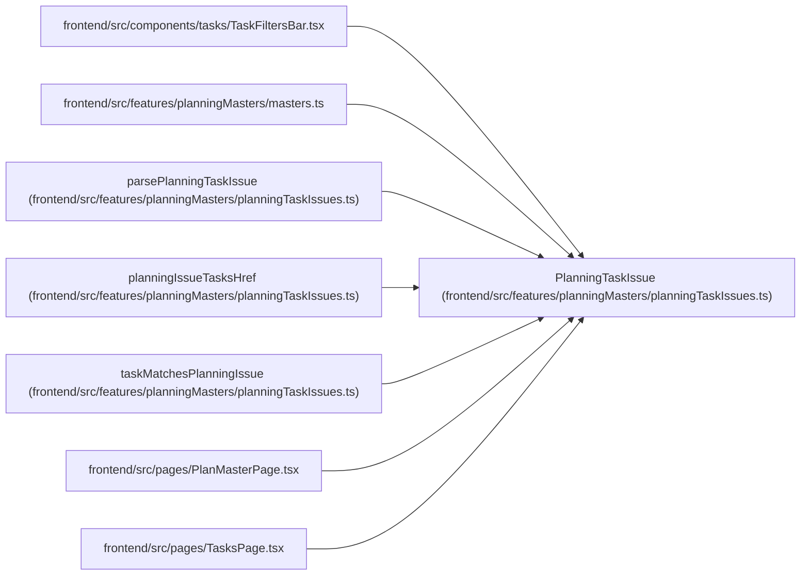

# PlanningTaskIssue

**Location:** `frontend/src/features/planningMasters/planningTaskIssues.ts:16`
**Kind:** Type alias
**Bases:** —
**Module:** [planningTaskIssues](../modules/planningTaskIssues.md)

## Description

_Auto-generated from `PlanningTaskIssue` in `frontend/src/features/planningMasters/planningTaskIssues.ts`._

## Attributes

*No annotated attributes found.*

## Methods

*No public methods. Inherits from base classes.*

## Relationships

<!-- Auto-generated relationship summary. Do not edit by hand. -->

### Summary

| Module | Methods | Attributes |
|---|---:|---|
| [planningTaskIssues](../modules/planningTaskIssues.md) | 0 | — |

### References

| Reference | Kind | Source | Call sites |
|---|---|---|---:|
| `TaskFiltersBar` | import | [TaskFiltersBar](../modules/TaskFiltersBar.md) | — |
| `masters` | import | [planningMasters_masters](../modules/planningMasters_masters.md) | — |
| `parsePlanningTaskIssue` | type_reference | [planningTaskIssues](../modules/planningTaskIssues.md) | — |
| `planningIssueTasksHref` | type_reference | [planningTaskIssues](../modules/planningTaskIssues.md) | — |
| `taskMatchesPlanningIssue` | type_reference | [planningTaskIssues](../modules/planningTaskIssues.md) | — |
| `PlanMasterPage` | import | [PlanMasterPage](../modules/PlanMasterPage.md) | — |
| `TasksPage` | import | [TasksPage](../modules/TasksPage.md) | — |
