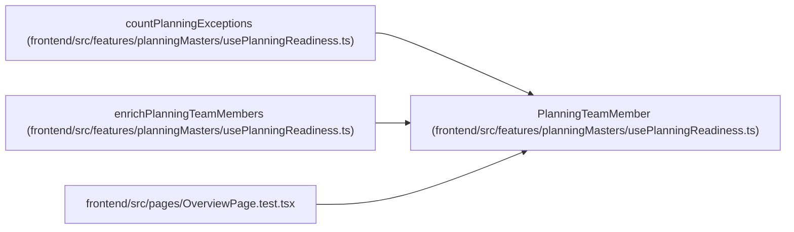

# PlanningTeamMember

**Location:** `frontend/src/features/planningMasters/usePlanningReadiness.ts:29`
**Kind:** Type alias
**Bases:** —
**Module:** [usePlanningReadiness](../modules/usePlanningReadiness.md)

## Description

_Auto-generated from `PlanningTeamMember` in `frontend/src/features/planningMasters/usePlanningReadiness.ts`._

## Attributes

*No annotated attributes found.*

## Methods

*No public methods. Inherits from base classes.*

## Relationships

<!-- Auto-generated relationship summary. Do not edit by hand. -->

### Summary

| Module | Methods | Attributes |
|---|---:|---|
| [usePlanningReadiness](../modules/usePlanningReadiness.md) | 0 | — |

### References

| Reference | Kind | Source | Call sites |
|---|---|---|---:|
| `countPlanningExceptions` | type_reference | [usePlanningReadiness](../modules/usePlanningReadiness.md) | — |
| `enrichPlanningTeamMembers` | type_reference | [usePlanningReadiness](../modules/usePlanningReadiness.md) | — |
| `OverviewPage.test` | import | [OverviewPage.test](../modules/OverviewPage.test.md) | — |
