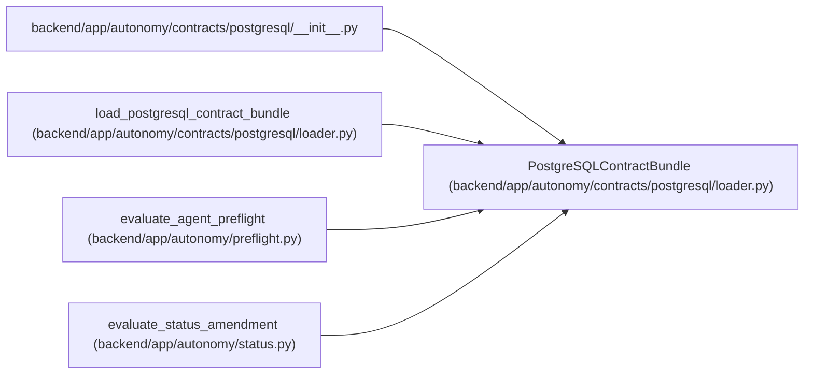

# PostgreSQLContractBundle

**Location:** `backend/app/autonomy/contracts/postgresql/loader.py:153`
**Kind:** Class
**Bases:** —
**Module:** [loader](../modules/loader.md)

**Decorators:** `@dataclass(frozen=True)`

## Description

_Auto-generated from `PostgreSQLContractBundle` in `backend/app/autonomy/contracts/postgresql/loader.py`._

## Attributes

| Name | Type | Default | Description |
|------|------|---------|-------------|
| `manifest` | `PostgreSQLContractManifest` | *required* | — |
| `manifest_bytes` | `bytes` | *required* | — |
| `manifest_digest` | `str` | *required* | — |
| `members` | `dict[str, bytes]` | *required* | — |
| `archive_verified` | `bool` | *required* | — |
| `blocker_codes` | `tuple[str, ...]` | *required* | — |

## Methods

| Method | Signature | Decorators | Description |
|--------|-----------|------------|-------------|
| `member_json` | `(path: str) -> object` | — | — |

## Relationships

<!-- Auto-generated relationship summary. Do not edit by hand. -->

### Summary

| Module | Methods | Attributes |
|---|---:|---|
| [loader](../modules/loader.md) | 1 | `archive_verified`, `blocker_codes`, `manifest`, `manifest_bytes`, `manifest_digest`, `members` |

### References

| Reference | Kind | Source | Call sites |
|---|---|---|---:|
| `__init__` | import | [postgresql___init__](../modules/postgresql___init__.md) | — |
| `load_postgresql_contract_bundle` | call | [loader](../modules/loader.md) | 1 |
| `load_postgresql_contract_bundle` | type_reference | [loader](../modules/loader.md) | — |
| `evaluate_agent_preflight` | type_reference | [preflight](../modules/preflight.md) | — |
| `evaluate_status_amendment` | type_reference | [status](../modules/status.md) | — |
