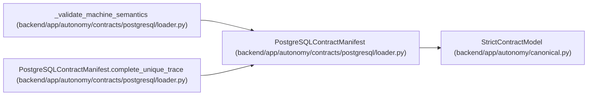

# PostgreSQLContractManifest

**Location:** `backend/app/autonomy/contracts/postgresql/loader.py:87`
**Kind:** Pydantic model
**Bases:** `StrictContractModel`
**Module:** [loader](../modules/loader.md)

## Description

_Auto-generated from `PostgreSQLContractManifest` in `backend/app/autonomy/contracts/postgresql/loader.py`._

## Validators

| Method | Scope | Fields | Mode | Options |
|--------|-------|--------|------|---------|
| `complete_unique_trace` | model | — | after | — |

## Attributes

| Name | Type | Wire name | Required | Nullable | Default | Constraints | Examples | Description |
|------|------|-----------|----------|----------|---------|-------------|-------------|----------|
| `schema_version` | `Literal['workchord-postgresql-contract-manifest-v1']` | `schema_version` | Yes | No | — | — | — | — |
| `bundle_state` | `Literal['implementation-seed-external-archive-required']` | `bundle_state` | Yes | No | — | — | — | — |
| `source_inputs` | `tuple[ContractSourceInput, ...]` | `source_inputs` | Yes | No | — | max_length=256; min_length=1 | — | — |
| `machine_members` | `tuple[ContractMachineMember, ...]` | `machine_members` | Yes | No | — | max_length=256; min_length=1 | — | — |
| `trace` | `ContractTrace` | `trace` | Yes | No | — | — | — | — |

## Methods

| Method | Signature | Decorators | Description |
|--------|-----------|------------|-------------|
| `complete_unique_trace` | `() -> 'PostgreSQLContractManifest'` | `@model_validator(mode='after')` | — |

## Relationships

<!-- Auto-generated relationship summary. Do not edit by hand. -->

### Summary

| Module | Methods | Attributes |
|---|---:|---|
| [loader](../modules/loader.md) | 1 | `bundle_state`, `machine_members`, `schema_version`, `source_inputs`, `trace` |

### Structure

| Kind | Entity | Module |
|---|---|---|
| Base | `StrictContractModel` | [autonomy_canonical](../modules/autonomy_canonical.md) |

### References

| Reference | Kind | Source | Call sites |
|---|---|---|---:|
| `_validate_machine_semantics` | type_reference | [loader](../modules/loader.md) | — |
| `PostgreSQLContractManifest.complete_unique_trace` | type_reference | [loader](../modules/loader.md) | — |
