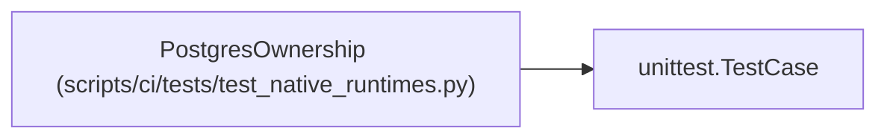

# PostgresOwnership

**Location:** `scripts/ci/tests/test_native_runtimes.py:284`
**Kind:** Class
**Bases:** `unittest.TestCase`
**Module:** [test_native_runtimes](../modules/test_native_runtimes.md)

## Description

_Auto-generated from `PostgresOwnership` in `scripts/ci/tests/test_native_runtimes.py`._

## Attributes

*No annotated attributes found.*

## Methods

| Method | Signature | Decorators | Description |
|--------|-----------|------------|-------------|
| `test_unowned_cluster_cannot_be_stopped` | `()` | — | — |
| `test_start_uses_builtin_locale_and_removes_password_file` | `()` | — | — |

## Relationships

<!-- Auto-generated relationship summary. Do not edit by hand. -->

### Summary

| Module | Methods | Attributes |
|---|---:|---|
| [test_native_runtimes](../modules/test_native_runtimes.md) | 2 | — |

### Structure

| Kind | Entity | Module |
|---|---|---|
| Base | `unittest.TestCase` | — |
