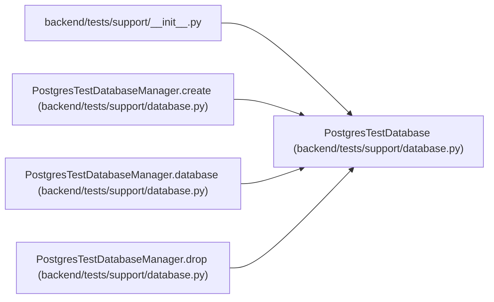

# PostgresTestDatabase

**Location:** `backend/tests/support/database.py:98`
**Kind:** Class
**Bases:** —
**Module:** [support_database](../modules/support_database.md)

**Decorators:** `@dataclass(frozen=True)`

## Description

One uniquely named PostgreSQL database owned by a fixture.

## Attributes

| Name | Type | Default | Description |
|------|------|---------|-------------|
| `name` | `str` | *required* | — |
| `url` | `str` | *required* | — |
| `encoding` | `str` | *required* | — |
| `locale_provider` | `str` | *required* | — |
| `locale` | `str` | *required* | — |
| `collation_version` | `str` | *required* | — |
| `timezone` | `str` | *required* | — |
| `search_path` | `str` | *required* | — |
| `migration_role` | `str` | *required* | — |
| `runtime_role` | `str` | *required* | — |
| `role_timezone` | `str` | *required* | — |
| `role_search_path` | `str` | *required* | — |
| `runtime_can_create_public` | `bool` | *required* | — |
| `runtime_can_create_application_schema` | `bool` | *required* | — |
| `default_table_privileges` | `tuple[str, ...]` | *required* | — |
| `default_sequence_privileges` | `tuple[str, ...]` | *required* | — |

## Methods

*No public methods. Inherits from base classes.*

## Relationships

<!-- Auto-generated relationship summary. Do not edit by hand. -->

### Summary

| Module | Methods | Attributes |
|---|---:|---|
| [support_database](../modules/support_database.md) | 0 | `collation_version`, `default_sequence_privileges`, `default_table_privileges`, `encoding`, `locale`, `locale_provider`, `migration_role`, `name`, `role_search_path`, `role_timezone`, `runtime_can_create_application_schema`, `runtime_can_create_public` |

### References

| Reference | Kind | Source | Call sites |
|---|---|---|---:|
| `__init__` | import | [support___init__](../modules/support___init__.md) | — |
| `PostgresTestDatabaseManager.create` | call | [support_database](../modules/support_database.md) | 1 |
| `PostgresTestDatabaseManager.create` | type_reference | [support_database](../modules/support_database.md) | — |
| `PostgresTestDatabaseManager.database` | type_reference | [support_database](../modules/support_database.md) | — |
| `PostgresTestDatabaseManager.drop` | type_reference | [support_database](../modules/support_database.md) | — |
