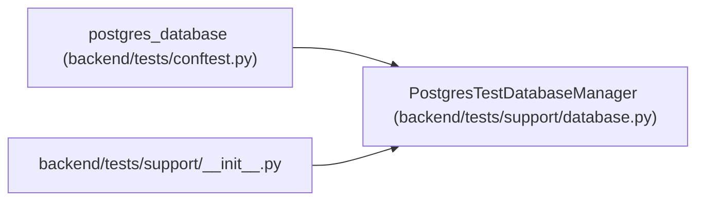

# PostgresTestDatabaseManager

**Location:** `backend/tests/support/database.py:119`
**Kind:** Class
**Bases:** —
**Module:** [support_database](../modules/support_database.md)

## Description

Create and drop isolated PostgreSQL databases through a local admin URL.

## Attributes

*No annotated attributes found.*

## Methods

| Method | Signature | Decorators | Description |
|--------|-----------|------------|-------------|
| `__init__` | `(admin_url: str, *, deployment_environment: str \| None = None, allowed_hosts: frozenset[str] = DEFAULT_POSTGRES_HOSTS) -> None` | — | — |
| `_target_url` | `(name: str) -> URL` | — | — |
| `create` | `() -> PostgresTestDatabase` | — | Create one empty contract-shaped database and return its facts. |
| `_drop_name` | `(name: str) -> None` | — | — |
| `drop` | `(database: PostgresTestDatabase) -> None` | — | Drop one database previously returned by this manager. |
| `cleanup` | `() -> None` | — | Best-effort deterministic cleanup for every database still owned. |
| `database` | `() -> Iterator[PostgresTestDatabase]` | `@contextmanager` | Create and always drop one database around a test block. |

## Relationships

<!-- Auto-generated relationship summary. Do not edit by hand. -->

### Summary

| Module | Methods | Attributes |
|---|---:|---|
| [support_database](../modules/support_database.md) | 7 | — |

### References

| Reference | Kind | Source | Call sites |
|---|---|---|---:|
| `postgres_database` | call | [conftest](../modules/conftest.md) | 1 |
| `__init__` | import | [support___init__](../modules/support___init__.md) | — |
