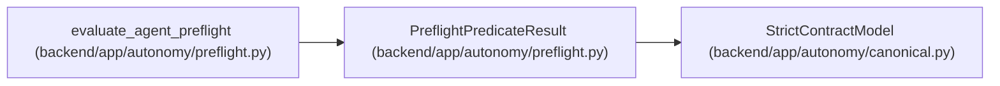

# PreflightPredicateResult

**Location:** `backend/app/autonomy/preflight.py:85`
**Kind:** Pydantic model
**Bases:** `StrictContractModel`
**Module:** [preflight](../modules/preflight.md)

## Description

_Auto-generated from `PreflightPredicateResult` in `backend/app/autonomy/preflight.py`._

## Attributes

| Name | Type | Wire name | Required | Nullable | Default | Constraints | Examples | Description |
|------|------|-----------|----------|----------|---------|-------------|-------------|----------|
| `predicate_id` | `str` | `predicate_id` | Yes | No | — | pattern=unknown (IDENTIFIER_PATTERN) | — | — |
| `state` | `Literal['passed', 'blocked_external', 'autonomy_not_ready', 'no_ship']` | `state` | Yes | No | — | — | — | — |
| `required_evidence_kind` | `str` | `required_evidence_kind` | Yes | No | — | pattern=unknown (IDENTIFIER_PATTERN) | — | — |
| `evidence_object_digest` | `str \| None` | `evidence_object_digest` | No | Yes | `None` | pattern=unknown (SHA256_PATTERN) | — | — |
| `blocker_code` | `str \| None` | `blocker_code` | No | Yes | `None` | pattern=unknown (IDENTIFIER_PATTERN) | — | — |

## Methods

*No public methods. Inherits from base classes.*

## Relationships

<!-- Auto-generated relationship summary. Do not edit by hand. -->

### Summary

| Module | Methods | Attributes |
|---|---:|---|
| [preflight](../modules/preflight.md) | 0 | `blocker_code`, `evidence_object_digest`, `predicate_id`, `required_evidence_kind`, `state` |

### Structure

| Kind | Entity | Module |
|---|---|---|
| Base | `StrictContractModel` | [autonomy_canonical](../modules/autonomy_canonical.md) |

### References

| Reference | Kind | Source | Call sites |
|---|---|---|---:|
| `evaluate_agent_preflight` | call | [preflight](../modules/preflight.md) | 1 |
