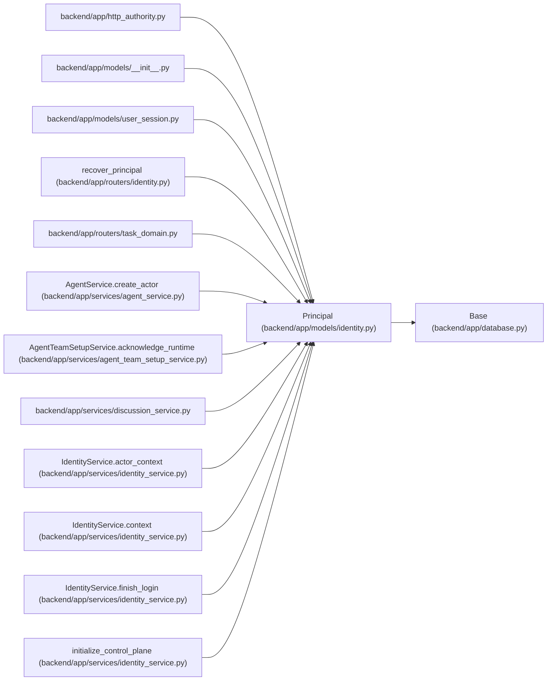

# Principal

**Location:** `backend/app/models/identity.py:12`
**Kind:** Class
**Bases:** `Base`
**Module:** [models_identity](../modules/models_identity.md)

## Description

_Auto-generated from `Principal` in `backend/app/models/identity.py`._

## Attributes

| Name | Type | Default | Description |
|------|------|---------|-------------|
| `id` | `Mapped[int]` | `mapped_column(Integer, primary_key=True)` | — |
| `kind` | `Mapped[str]` | `mapped_column(String(16), nullable=False)` | — |
| `display_name` | `Mapped[str]` | `mapped_column(String(255), nullable=False)` | — |
| `enabled` | `Mapped[bool]` | `mapped_column(Boolean, default=True, nullable=False)` | — |
| `agent_actor_id` | `Mapped[int \| None]` | `mapped_column(ForeignKey('agent_actors.id', ondelete='RESTRICT'), unique=True)` | — |
| `created_at` | `Mapped[datetime]` | `mapped_column(UTCDateTime(), default=utc_now)` | — |

## Methods

*No public methods. Inherits from base classes.*

## Relationships

<!-- Auto-generated relationship summary. Do not edit by hand. -->

### Summary

| Module | Methods | Attributes |
|---|---:|---|
| [models_identity](../modules/models_identity.md) | 0 | `agent_actor_id`, `created_at`, `display_name`, `enabled`, `id`, `kind` |

### Structure

| Kind | Entity | Module |
|---|---|---|
| Base | `Base` | [app_database](../modules/app_database.md) |

### References

| Reference | Kind | Source | Call sites |
|---|---|---|---:|
| `http_authority` | import | [http_authority](../modules/http_authority.md) | — |
| `__init__` | import | [models___init__](../modules/models___init__.md) | — |
| `user_session` | import | [user_session](../modules/user_session.md) | — |
| `recover_principal` | type_reference | [routers_identity](../modules/routers_identity.md) | — |
| `task_domain` | import | [routers_task_domain](../modules/routers_task_domain.md) | — |
| `AgentService.create_actor` | call | [agent_service](../modules/agent_service.md) | 1 |
| `AgentTeamSetupService.acknowledge_runtime` | call | [agent_team_setup_service](../modules/agent_team_setup_service.md) | 1 |
| `discussion_service` | import | [discussion_service](../modules/discussion_service.md) | — |
| `IdentityService.actor_context` | call | [identity_service](../modules/identity_service.md) | 1 |
| `IdentityService.context` | type_reference | [identity_service](../modules/identity_service.md) | — |
| `IdentityService.finish_login` | call | [identity_service](../modules/identity_service.md) | 1 |
| `initialize_control_plane` | call | [identity_service](../modules/identity_service.md) | 1 |

> References: showing 12 of 31 logical references; 19 omitted by the 12-row generated summary limit.
