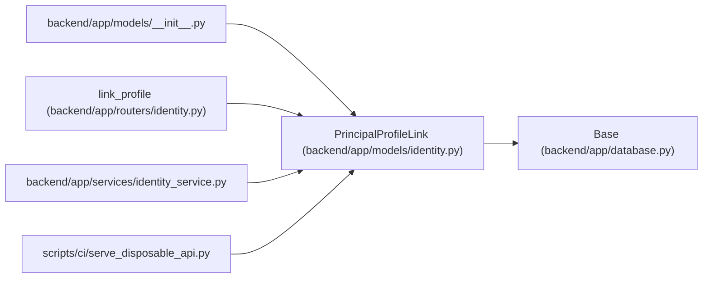

# PrincipalProfileLink

**Location:** `backend/app/models/identity.py:58`
**Kind:** Class
**Bases:** `Base`
**Module:** [models_identity](../modules/models_identity.md)

## Description

_Auto-generated from `PrincipalProfileLink` in `backend/app/models/identity.py`._

## Attributes

| Name | Type | Default | Description |
|------|------|---------|-------------|
| `principal_id` | `Mapped[int]` | `mapped_column(ForeignKey('principals.id', ondelete='CASCADE'), primary_key=True)` | — |
| `profile_id` | `Mapped[int]` | `mapped_column(ForeignKey('team_member_profiles.id', ondelete='RESTRICT'), unique=True)` | — |
| `linked_by_principal_id` | `Mapped[int]` | `mapped_column(ForeignKey('principals.id', ondelete='RESTRICT'))` | — |
| `created_at` | `Mapped[datetime]` | `mapped_column(UTCDateTime(), default=utc_now)` | — |

## Methods

*No public methods. Inherits from base classes.*

## Relationships

<!-- Auto-generated relationship summary. Do not edit by hand. -->

### Summary

| Module | Methods | Attributes |
|---|---:|---|
| [models_identity](../modules/models_identity.md) | 0 | `created_at`, `linked_by_principal_id`, `principal_id`, `profile_id` |

### Structure

| Kind | Entity | Module |
|---|---|---|
| Base | `Base` | [app_database](../modules/app_database.md) |

### References

| Reference | Kind | Source | Call sites |
|---|---|---|---:|
| `__init__` | import | [models___init__](../modules/models___init__.md) | — |
| `link_profile` | call | [routers_identity](../modules/routers_identity.md) | 1 |
| `identity_service` | import | [identity_service](../modules/identity_service.md) | — |
| `serve_disposable_api` | import | [serve_disposable_api](../modules/serve_disposable_api.md) | — |
