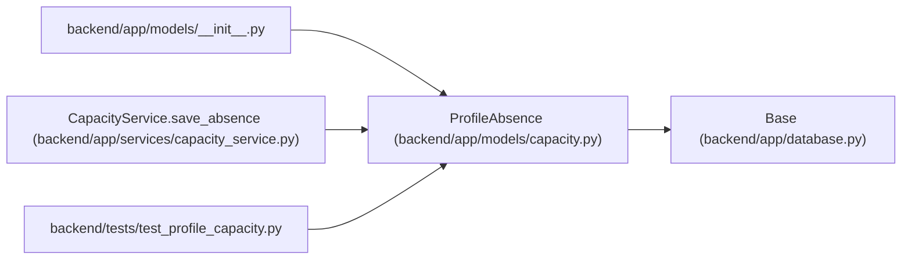

# ProfileAbsence

**Location:** `backend/app/models/capacity.py:30`
**Kind:** Class
**Bases:** `Base`
**Module:** [models_capacity](../modules/models_capacity.md)

## Description

Canonical profile absence with optimistic versioning, a retained tombstone and provenance. Legacy vacation IDs remain linked through adapter rows. Overlapping ranges are counted as a union, and iteration snapshot restoration does not overwrite person availability.

## Attributes

| Name | Type | Default | Description |
|------|------|---------|-------------|
| `id` | `Mapped[int]` | `mapped_column(Integer, primary_key=True, autoincrement=True)` | — |
| `profile_id` | `Mapped[int]` | `mapped_column(ForeignKey('team_member_profiles.id', ondelete='CASCADE'), index=True)` | — |
| `start_date` | `Mapped[date]` | `mapped_column(Date, nullable=False)` | — |
| `end_date` | `Mapped[date]` | `mapped_column(Date, nullable=False)` | — |
| `version` | `Mapped[int]` | `mapped_column(Integer, nullable=False, default=1)` | — |
| `deleted` | `Mapped[bool]` | `mapped_column(nullable=False, default=False)` | — |
| `provenance` | `Mapped[list]` | `mapped_column(JSON, nullable=False, default=list)` | — |

## Methods

*No public methods. Inherits from base classes.*

## Relationships

<!-- Auto-generated relationship summary. Do not edit by hand. -->

### Summary

| Module | Methods | Attributes |
|---|---:|---|
| [models_capacity](../modules/models_capacity.md) | 0 | `deleted`, `end_date`, `id`, `profile_id`, `provenance`, `start_date`, `version` |

### Structure

| Kind | Entity | Module |
|---|---|---|
| Base | `Base` | [app_database](../modules/app_database.md) |

### References

| Reference | Kind | Source | Call sites |
|---|---|---|---:|
| `__init__` | import | [models___init__](../modules/models___init__.md) | — |
| `CapacityService.save_absence` | call | [capacity_service](../modules/capacity_service.md) | 1 |
| `test_profile_capacity` | import | [test_profile_capacity](../modules/test_profile_capacity.md) | — |
