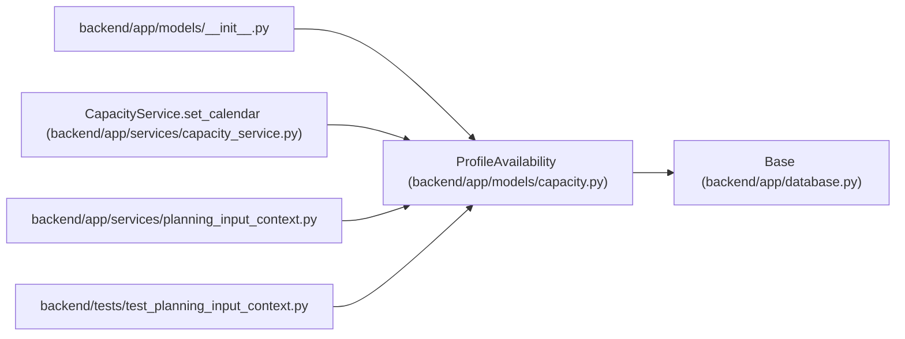

# ProfileAvailability

**Location:** `backend/app/models/capacity.py:19`
**Kind:** Class
**Bases:** `Base`
**Module:** [models_capacity](../modules/models_capacity.md)

## Description

Profile-owned calendar selection with a version, backfill provenance and unresolved legacy calendar IDs. An explicit selection reconciles the current calendar; allocation calendar differences remain visible to the person or operator.

## Attributes

| Name | Type | Default | Description |
|------|------|---------|-------------|
| `profile_id` | `Mapped[int]` | `mapped_column(ForeignKey('team_member_profiles.id', ondelete='CASCADE'), primary_key=True)` | — |
| `calendar_id` | `Mapped[int \| None]` | `mapped_column(ForeignKey('calendars.id', ondelete='RESTRICT'))` | — |
| `version` | `Mapped[int]` | `mapped_column(Integer, nullable=False, default=1)` | — |
| `provenance` | `Mapped[str]` | `mapped_column(String(40), nullable=False, default='explicit')` | — |
| `calendar_conflicts` | `Mapped[list]` | `mapped_column(JSON, nullable=False, default=list)` | — |

## Methods

*No public methods. Inherits from base classes.*

## Relationships

<!-- Auto-generated relationship summary. Do not edit by hand. -->

### Summary

| Module | Methods | Attributes |
|---|---:|---|
| [models_capacity](../modules/models_capacity.md) | 0 | `calendar_conflicts`, `calendar_id`, `profile_id`, `provenance`, `version` |

### Structure

| Kind | Entity | Module |
|---|---|---|
| Base | `Base` | [app_database](../modules/app_database.md) |

### References

| Reference | Kind | Source | Call sites |
|---|---|---|---:|
| `__init__` | import | [models___init__](../modules/models___init__.md) | — |
| `CapacityService.set_calendar` | call | [capacity_service](../modules/capacity_service.md) | 1 |
| `planning_input_context` | import | [planning_input_context](../modules/planning_input_context.md) | — |
| `test_planning_input_context` | import | [test_planning_input_context](../modules/test_planning_input_context.md) | — |
