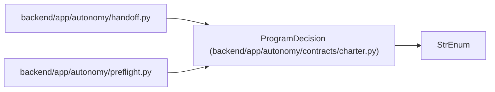

# ProgramDecision

**Location:** `backend/app/autonomy/contracts/charter.py:32`
**Kind:** Enum
**Bases:** `StrEnum`
**Module:** [charter](../modules/charter.md)

## Description

_Auto-generated from `ProgramDecision` in `backend/app/autonomy/contracts/charter.py`._

## Attributes

| Name | Declared value | Description |
|------|-------|-------------|
| `NO_SHIP` | `'NO-SHIP'` | — |
| `READY_FOR_MANUAL_PUBLICATION` | `'READY-FOR-MANUAL-PUBLICATION'` | — |

## Methods

*No public methods. Inherits from base classes.*

## Relationships

<!-- Auto-generated relationship summary. Do not edit by hand. -->

### Summary

| Module | Methods | Attributes |
|---|---:|---|
| [charter](../modules/charter.md) | 0 | `NO_SHIP`, `READY_FOR_MANUAL_PUBLICATION` |

### Structure

| Kind | Entity | Module |
|---|---|---|
| Base | `StrEnum` | — |

### References

| Reference | Kind | Source | Call sites |
|---|---|---|---:|
| `handoff` | import | [handoff](../modules/handoff.md) | — |
| `preflight` | import | [preflight](../modules/preflight.md) | — |
