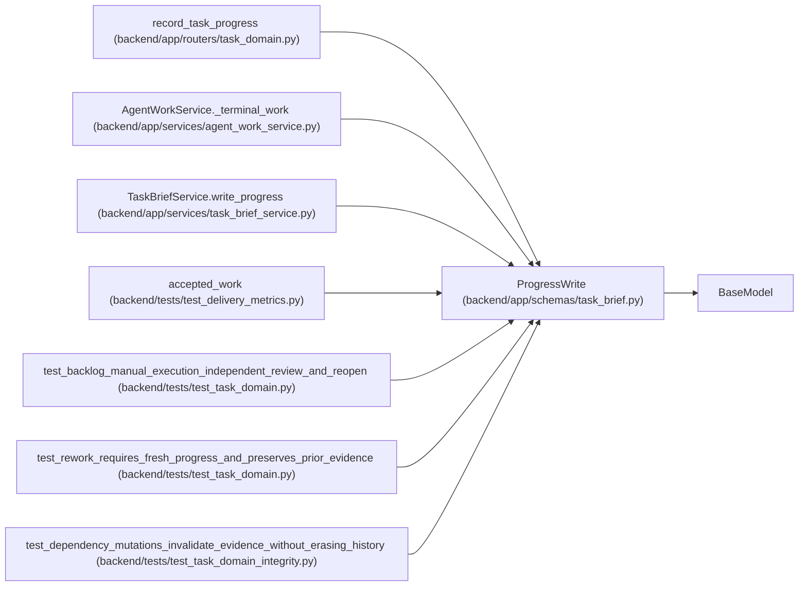

# ProgressWrite

**Location:** `backend/app/schemas/task_brief.py:64`
**Kind:** Pydantic model
**Bases:** `BaseModel`
**Module:** [schemas_task_brief](../modules/schemas_task_brief.md)

## Description

_Auto-generated from `ProgressWrite` in `backend/app/schemas/task_brief.py`._

## Model Configuration

| Setting | Value | Source |
|---------|-------|--------|
| `extra` | `'forbid'` | model_config |

## Validators

| Method | Scope | Fields | Mode | Options |
|--------|-------|--------|------|---------|
| `validate_evidence` | model | — | after | — |

## Attributes

| Name | Type | Wire name | Required | Nullable | Default | Constraints | Examples | Description |
|------|------|-----------|----------|----------|---------|-------------|-------------|----------|
| `expected_version` | `int` | `expected_version` | Yes | No | — | ge=1 | — | — |
| `criteria` | `list[CriterionProgress]` | `criteria` | Yes | No | — | max_length=100 | — | — |
| `artifacts` | `list[str]` | `artifacts` | No | No | factory: `list` | max_length=50 | — | — |

## Methods

| Method | Signature | Decorators | Description |
|--------|-----------|------------|-------------|
| `validate_evidence` | `()` | `@model_validator(mode='after')` | — |

## Relationships

<!-- Auto-generated relationship summary. Do not edit by hand. -->

### Summary

| Module | Methods | Attributes |
|---|---:|---|
| [schemas_task_brief](../modules/schemas_task_brief.md) | 1 | `artifacts`, `criteria`, `expected_version` |

### Structure

| Kind | Entity | Module |
|---|---|---|
| Base | `BaseModel` | — |

### References

| Reference | Kind | Source | Call sites |
|---|---|---|---:|
| `record_task_progress` | type_reference | [routers_task_domain](../modules/routers_task_domain.md) | — |
| `AgentWorkService._terminal_work` | call | [agent_work_service](../modules/agent_work_service.md) | 1 |
| `TaskBriefService.write_progress` | type_reference | [task_brief_service](../modules/task_brief_service.md) | — |
| `accepted_work` | call | [test_delivery_metrics](../modules/test_delivery_metrics.md) | 1 |
| `test_backlog_manual_execution_independent_review_and_reopen` | call | [test_task_domain](../modules/test_task_domain.md) | 1 |
| `test_rework_requires_fresh_progress_and_preserves_prior_evidence` | call | [test_task_domain](../modules/test_task_domain.md) | 1 |
| `test_dependency_mutations_invalidate_evidence_without_erasing_history` | call | [test_task_domain_integrity](../modules/test_task_domain_integrity.md) | 1 |
