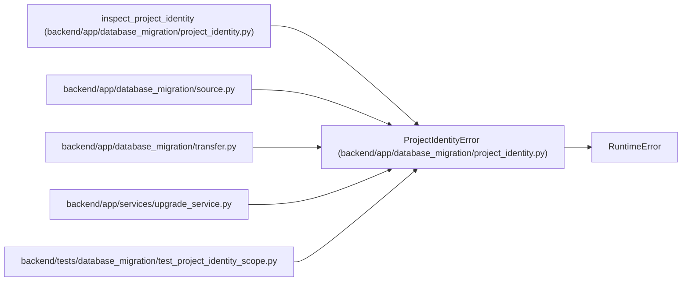

# ProjectIdentityError

**Location:** `backend/app/database_migration/project_identity.py:12`
**Kind:** Class
**Bases:** `RuntimeError`
**Module:** [project_identity](../modules/project_identity.md)

## Description

Refuse an ambiguous identity without changing historical associations.

## Attributes

*No annotated attributes found.*

## Methods

| Method | Signature | Decorators | Description |
|--------|-----------|------------|-------------|
| `__init__` | `(code, diagnostics = (), *, truncated = False)` | — | — |
| `detail` | `()` | — | — |

## Relationships

<!-- Auto-generated relationship summary. Do not edit by hand. -->

### Summary

| Module | Methods | Attributes |
|---|---:|---|
| [project_identity](../modules/project_identity.md) | 2 | — |

### Structure

| Kind | Entity | Module |
|---|---|---|
| Base | `RuntimeError` | — |

### References

| Reference | Kind | Source | Call sites |
|---|---|---|---:|
| `inspect_project_identity` | call | [project_identity](../modules/project_identity.md) | 7 |
| `source` | import | [source](../modules/source.md) | — |
| `transfer` | import | [transfer](../modules/transfer.md) | — |
| `upgrade_service` | import | [upgrade_service](../modules/upgrade_service.md) | — |
| `test_project_identity_scope` | import | [test_project_identity_scope](../modules/test_project_identity_scope.md) | — |
