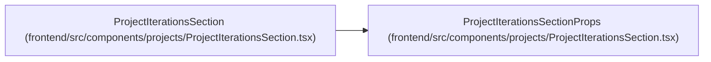

# ProjectIterationsSectionProps

**Location:** `frontend/src/components/projects/ProjectIterationsSection.tsx:15`
**Kind:** Class
**Bases:** —
**Module:** [ProjectIterationsSection](../modules/ProjectIterationsSection.md)

## Description

_Auto-generated from `ProjectIterationsSectionProps` in `frontend/src/components/projects/ProjectIterationsSection.tsx`._

## Attributes

| Name | Type | Default | Description |
|------|------|---------|-------------|
| `projectId` | `number` | *required* | — |
| `projectName` | `string` | *required* | — |
| `iterations` | `Iteration[]` | *required* | — |
| `isLoading` | `boolean` | *required* | — |

## Methods

*No public methods. Inherits from base classes.*

## Relationships

<!-- Auto-generated relationship summary. Do not edit by hand. -->

### Summary

| Module | Methods | Attributes |
|---|---:|---|
| [ProjectIterationsSection](../modules/ProjectIterationsSection.md) | 0 | `isLoading`, `iterations`, `projectId`, `projectName` |

### References

| Reference | Kind | Source | Call sites |
|---|---|---|---:|
| `ProjectIterationsSection` | type_reference | [ProjectIterationsSection](../modules/ProjectIterationsSection.md) | — |
