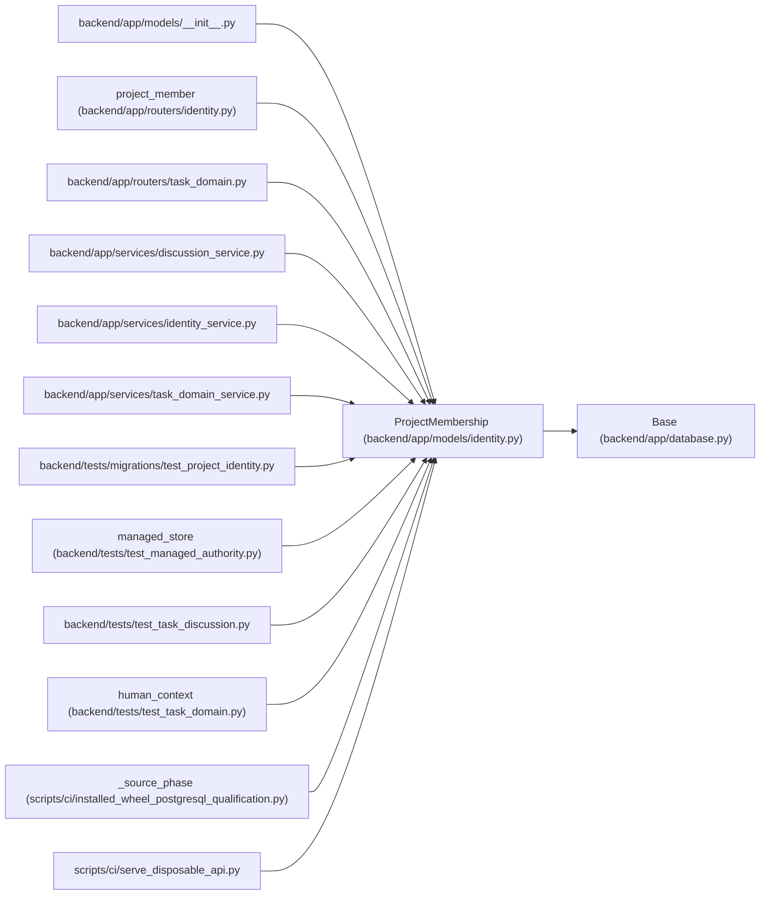

# ProjectMembership

**Location:** `backend/app/models/identity.py:49`
**Kind:** Class
**Bases:** `Base`
**Module:** [models_identity](../modules/models_identity.md)

## Description

_Auto-generated from `ProjectMembership` in `backend/app/models/identity.py`._

## Attributes

| Name | Type | Default | Description |
|------|------|---------|-------------|
| `principal_id` | `Mapped[int]` | `mapped_column(ForeignKey('principals.id', ondelete='CASCADE'), primary_key=True)` | — |
| `project_id` | `Mapped[int]` | `mapped_column(ForeignKey('projects.id', ondelete='CASCADE'), primary_key=True)` | — |
| `role` | `Mapped[str]` | `mapped_column(String(16), nullable=False)` | — |
| `created_at` | `Mapped[datetime]` | `mapped_column(UTCDateTime(), default=utc_now)` | — |

## Methods

*No public methods. Inherits from base classes.*

## Relationships

<!-- Auto-generated relationship summary. Do not edit by hand. -->

### Summary

| Module | Methods | Attributes |
|---|---:|---|
| [models_identity](../modules/models_identity.md) | 0 | `created_at`, `principal_id`, `project_id`, `role` |

### Structure

| Kind | Entity | Module |
|---|---|---|
| Base | `Base` | [app_database](../modules/app_database.md) |

### References

| Reference | Kind | Source | Call sites |
|---|---|---|---:|
| `__init__` | import | [models___init__](../modules/models___init__.md) | — |
| `project_member` | call | [routers_identity](../modules/routers_identity.md) | 1 |
| `task_domain` | import | [routers_task_domain](../modules/routers_task_domain.md) | — |
| `discussion_service` | import | [discussion_service](../modules/discussion_service.md) | — |
| `identity_service` | import | [identity_service](../modules/identity_service.md) | — |
| `task_domain_service` | import | [task_domain_service](../modules/task_domain_service.md) | — |
| `test_project_identity` | import | [test_project_identity](../modules/test_project_identity.md) | — |
| `managed_store` | call | [test_managed_authority](../modules/test_managed_authority.md) | 2 |
| `test_task_discussion` | import | [test_task_discussion](../modules/test_task_discussion.md) | — |
| `human_context` | call | [test_task_domain](../modules/test_task_domain.md) | 2 |
| `_source_phase` | call | [installed_wheel_postgresql_qualification](../modules/installed_wheel_postgresql_qualification.md) | 1 |
| `serve_disposable_api` | import | [serve_disposable_api](../modules/serve_disposable_api.md) | — |
