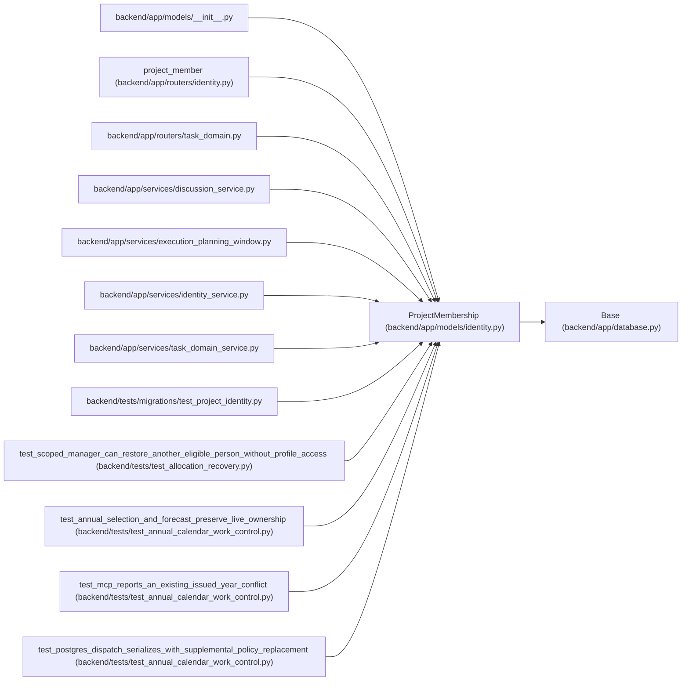

# ProjectMembership

**Location:** `backend/app/models/identity.py:49`
**Kind:** Class
**Bases:** `Base`
**Module:** [models_identity](../modules/models_identity.md)

## Description

_Auto-generated from `ProjectMembership` in `backend/app/models/identity.py`._

## Attributes

| Name | Type | Default | Description |
|------|------|---------|-------------|
| `principal_id` | `Mapped[int]` | `mapped_column(ForeignKey('principals.id', ondelete='CASCADE'), primary_key=True)` | — |
| `project_id` | `Mapped[int]` | `mapped_column(ForeignKey('projects.id', ondelete='CASCADE'), primary_key=True)` | — |
| `role` | `Mapped[str]` | `mapped_column(String(16), nullable=False)` | — |
| `created_at` | `Mapped[datetime]` | `mapped_column(UTCDateTime(), default=utc_now)` | — |

## Methods

*No declared methods.*

## Relationships

<!-- Auto-generated relationship summary. Do not edit by hand. -->

```mermaid
flowchart LR
    n0["ProjectMembership (backend/app/models/identity.py)"]
    n1["Base (backend/app/database.py)"]
    n2["backend/app/models/__init__.py"]
    n3["project_member (backend/app/routers/identity.py)"]
    n4["backend/app/routers/task_domain.py"]
    n5["backend/app/services/discussion_service.py"]
    n6["backend/app/services/execution_planning_window.py"]
    n7["backend/app/services/identity_service.py"]
    n8["backend/app/services/task_domain_service.py"]
    n9["backend/tests/migrations/test_project_identity.py"]
    n10["test_scoped_manager_can_restore_another_eligible_person_without_profile_access (backend/tests/test_allocation_recovery.py)"]
    n11["test_annual_selection_and_forecast_preserve_live_ownership (backend/tests/test_annual_calendar_work_control.py)"]
    n12["test_mcp_reports_an_existing_issued_year_conflict (backend/tests/test_annual_calendar_work_control.py)"]
    n13["test_postgres_dispatch_serializes_with_supplemental_policy_replacement (backend/tests/test_annual_calendar_work_control.py)"]
    n0 --> n1
    n2 --> n0
    n3 --> n0
    n4 --> n0
    n5 --> n0
    n6 --> n0
    n7 --> n0
    n8 --> n0
    n9 --> n0
    n10 --> n0
    n11 --> n0
    n12 --> n0
    n13 --> n0
    click n0 "../modules/models_identity.md"
    click n1 "../modules/app_database.md"
    click n2 "../modules/models___init__.md"
    click n3 "../modules/routers_identity.md"
    click n4 "../modules/routers_task_domain.md"
    click n5 "../modules/discussion_service.md"
    click n6 "../modules/execution_planning_window.md"
    click n7 "../modules/identity_service.md"
    click n8 "../modules/task_domain_service.md"
    click n9 "../modules/test_project_identity.md"
    click n10 "../modules/test_allocation_recovery.md"
    click n11 "../modules/test_annual_calendar_work_control.md"
    click n12 "../modules/test_annual_calendar_work_control.md"
    click n13 "../modules/test_annual_calendar_work_control.md"
```

### Summary

| Module | Methods | Attributes |
|---|---:|---|
| [models_identity](../modules/models_identity.md) | 0 | `created_at`, `principal_id`, `project_id`, `role` |

### Structure

| Kind | Entity | Module |
|---|---|---|
| Base | `Base` | [app_database](../modules/app_database.md) |

### References

| Reference | Kind | Source | Call sites |
|---|---|---|---:|
| `__init__` | import | [models___init__](../modules/models___init__.md) | — |
| `project_member` | call | [routers_identity](../modules/routers_identity.md) | 1 |
| `task_domain` | import | [routers_task_domain](../modules/routers_task_domain.md) | — |
| `discussion_service` | import | [discussion_service](../modules/discussion_service.md) | — |
| `execution_planning_window` | import | [execution_planning_window](../modules/execution_planning_window.md) | — |
| `identity_service` | import | [identity_service](../modules/identity_service.md) | — |
| `task_domain_service` | import | [task_domain_service](../modules/task_domain_service.md) | — |
| `test_project_identity` | import | [test_project_identity](../modules/test_project_identity.md) | — |
| `test_scoped_manager_can_restore_another_eligible_person_without_profile_access` | call | [test_allocation_recovery](../modules/test_allocation_recovery.md) | 1 |
| `test_annual_selection_and_forecast_preserve_live_ownership` | call | [test_annual_calendar_work_control](../modules/test_annual_calendar_work_control.md) | 1 |
| `test_mcp_reports_an_existing_issued_year_conflict` | call | [test_annual_calendar_work_control](../modules/test_annual_calendar_work_control.md) | 1 |
| `test_postgres_dispatch_serializes_with_supplemental_policy_replacement` | call | [test_annual_calendar_work_control](../modules/test_annual_calendar_work_control.md) | 1 |

> References: showing 12 of 25 logical references; 13 omitted by the 12-row generated summary limit.
