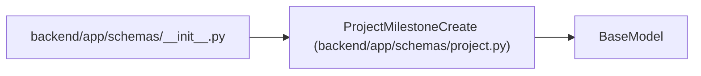

# ProjectMilestoneCreate

**Location:** `backend/app/schemas/project.py:180`
**Kind:** Pydantic model
**Bases:** `BaseModel`
**Module:** [schemas_project](../modules/schemas_project.md)

## Description

Schema for creating a project milestone.

## Model Configuration

| Setting | Value | Source |
|---------|-------|--------|
| `extra` | `'forbid'` | model_config |

## Attributes

| Name | Type | Wire name | Required | Nullable | Default | Constraints | Examples | Description |
|------|------|-----------|----------|----------|---------|-------------|-------------|----------|
| `project_id` | `int` | `project_id` | Yes | No | — | — | — | — |
| `name` | `str` | `name` | Yes | No | — | min_length=1; max_length=255 | — | — |
| `description` | `Optional[str]` | `description` | No | Yes | `None` | — | — | — |
| `target_date` | `Optional[date]` | `target_date` | No | Yes | `None` | — | — | — |
| `completed_at` | `Optional[datetime]` | `completed_at` | No | Yes | `None` | — | — | — |
| `sort_order` | `int` | `sort_order` | No | No | `0` | — | — | — |
| `status` | `ProjectMilestoneStatus` | `status` | No | No | `ProjectMilestoneStatus.PLANNED` | — | — | — |

## Methods

*No public methods. Inherits from base classes.*

## Relationships

<!-- Auto-generated relationship summary. Do not edit by hand. -->

### Summary

| Module | Methods | Attributes |
|---|---:|---|
| [schemas_project](../modules/schemas_project.md) | 0 | `completed_at`, `description`, `name`, `project_id`, `sort_order`, `status`, `target_date` |

### Structure

| Kind | Entity | Module |
|---|---|---|
| Base | `BaseModel` | — |

### References

| Reference | Kind | Source | Call sites |
|---|---|---|---:|
| `__init__` | import | [schemas___init__](../modules/schemas___init__.md) | — |
