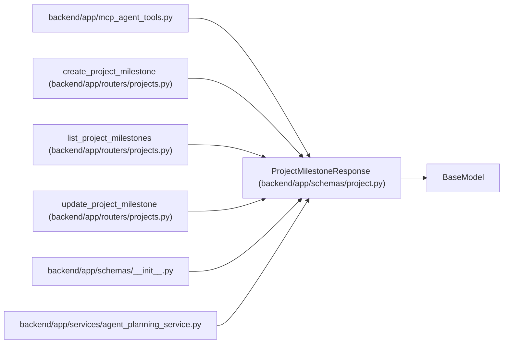

# ProjectMilestoneResponse

**Location:** `backend/app/schemas/project.py:209`
**Kind:** Pydantic model
**Bases:** `BaseModel`
**Module:** [schemas_project](../modules/schemas_project.md)

## Description

Schema for project milestone responses.

## Model Configuration

| Setting | Value | Source |
|---------|-------|--------|
| `from_attributes` | `True` | model_config |

## Attributes

| Name | Type | Wire name | Required | Nullable | Default | Constraints | Examples | Description |
|------|------|-----------|----------|----------|---------|-------------|-------------|----------|
| `id` | `int` | `id` | Yes | No | — | — | — | — |
| `project_id` | `int` | `project_id` | Yes | No | — | — | — | — |
| `name` | `str` | `name` | Yes | No | — | — | — | — |
| `description` | `Optional[str]` | `description` | No | Yes | `None` | — | — | — |
| `target_date` | `Optional[date]` | `target_date` | No | Yes | `None` | — | — | — |
| `completed_at` | `Optional[datetime]` | `completed_at` | No | Yes | `None` | — | — | — |
| `sort_order` | `int` | `sort_order` | Yes | No | — | — | — | — |
| `status` | `str` | `status` | Yes | No | — | — | — | — |
| `created_at` | `datetime` | `created_at` | Yes | No | — | — | — | — |
| `updated_at` | `datetime` | `updated_at` | Yes | No | — | — | — | — |

## Methods

*No public methods. Inherits from base classes.*

## Relationships

<!-- Auto-generated relationship summary. Do not edit by hand. -->

### Summary

| Module | Methods | Attributes |
|---|---:|---|
| [schemas_project](../modules/schemas_project.md) | 0 | `completed_at`, `created_at`, `description`, `id`, `name`, `project_id`, `sort_order`, `status`, `target_date`, `updated_at` |

### Structure

| Kind | Entity | Module |
|---|---|---|
| Base | `BaseModel` | — |

### References

| Reference | Kind | Source | Call sites |
|---|---|---|---:|
| `mcp_agent_tools` | import | [mcp_agent_tools](../modules/mcp_agent_tools.md) | — |
| `create_project_milestone` | type_reference | [projects](../modules/projects.md) | — |
| `list_project_milestones` | type_reference | [projects](../modules/projects.md) | — |
| `update_project_milestone` | type_reference | [projects](../modules/projects.md) | — |
| `__init__` | import | [schemas___init__](../modules/schemas___init__.md) | — |
| `agent_planning_service` | import | [agent_planning_service](../modules/agent_planning_service.md) | — |
