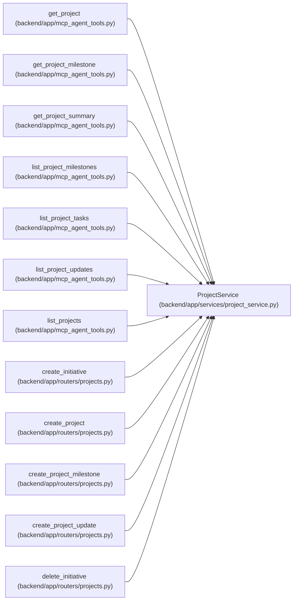

# ProjectService

**Location:** `backend/app/services/project_service.py:53`
**Kind:** Class
**Bases:** —
**Module:** [project_service](../modules/project_service.md)

## Description

Service for project CRUD, linked task retrieval, and summary metrics.

## Attributes

*No annotated attributes found.*

## Methods

| Method | Signature | Decorators | Description |
|--------|-----------|------------|-------------|
| `__init__` | `(db: AsyncSession)` | — | — |
| `_project_options` | `() -> tuple` | — | Return relationship loading options shared by project reads. |
| `_project_query` | `() -> Select` | — | Build a base project query with common relationship options. |
| `_enum_value` | `(value)` | — | Normalize Pydantic enum values before assigning to string columns. |
| `_normalize_text_key` | `(value: str \| None) -> str` | — | Return a lowercase matching key for profile backfill and legacy owner writes. |
| `_get_owner_member` | *(async)* `(owner_id: int) -> TeamMember \| None` | — | Load a legacy team-member owner by id. |
| `_get_owner_profile` | *(async)* `(profile_id: int) -> TeamMemberProfile \| None` | — | Load a reusable owner profile by id. |
| `_require_owner_profile_exists` | *(async)* `(owner_profile_id: Optional[int]) -> TeamMemberProfile \| None` | — | Validate an optional global owner profile reference. |
| `_find_matching_profile_for_member` | *(async)* `(member: TeamMember) -> TeamMemberProfile \| None` | — | Find an existing profile by email or display name for a legacy owner. |
| `_resolve_profile_for_legacy_owner` | *(async)* `(member: TeamMember) -> TeamMemberProfile` | — | Return or create the global profile for a legacy team-member owner. |
| `_resolve_owner_refs` | *(async)* `(owner_id: Optional[int], owner_profile_id: Optional[int]) -> tuple[Optional[int], Optional[int]]` | — | Normalize legacy and profile owner references for a write payload. |
| `_normalize_owner_update_data` | *(async)* `(update_data: dict) -> None` | — | Mutate update data so any owner write carries both transitional refs. |
| `_initiative_exists` | *(async)* `(initiative_id: int) -> bool` | — | Return whether an initiative exists without loading relationships. |
| `_require_initiative_exists` | *(async)* `(initiative_id: Optional[int]) -> None` | — | Validate an optional initiative reference. |
| `list_initiatives` | *(async)* `() -> Sequence[Initiative]` | — | List initiatives ordered for portfolio planning. |
| `get_initiative_by_id` | *(async)* `(initiative_id: int) -> Optional[Initiative]` | — | Get initiative by ID. |
| `count_initiative_projects` | *(async)* `(initiative_id: int) -> int` | — | Count projects assigned to an initiative. |
| `create_initiative` | *(async)* `(data: InitiativeCreate) -> Initiative` | — | Create an initiative. |
| `update_initiative` | *(async)* `(initiative_id: int, data: InitiativeUpdate) -> Optional[Initiative]` | — | Apply a partial initiative update. |
| `delete_initiative` | *(async)* `(initiative_id: int) -> bool` | — | Delete an initiative, leaving assigned projects intact. |
| `list_projects` | *(async)* `() -> Sequence[Project]` | — | List projects ordered for planning views. |
| `list_portfolio_summaries` | *(async)* `() -> list[ProjectPortfolioSummary]` | — | Return compact project signals with one aggregate query for the portfolio. |
| `get_by_id` | *(async)* `(project_id: int) -> Optional[Project]` | — | Get project by ID. |
| `_project_exists` | *(async)* `(project_id: int) -> bool` | — | Return whether a project exists without loading relationships. |
| `create` | *(async)* `(data: ProjectCreate, *, commit: bool = True) -> Project` | — | Create a project, optionally leaving commit ownership to the caller. |
| `update` | *(async)* `(project_id: int, data: ProjectUpdate, *, commit: bool = True) -> Optional[Project]` | `@schedule_input_command('project')` | Apply a partial project update, optionally deferring the commit. |
| `create_project_update` | *(async)* `(project_id: int, data: ProjectUpdateEntryCreate, created_by_session_id: Optional[int], *, created_by_actor_id: Optional[int] = None, evidence_json: Optional[dict] = None, correlation_id: Optional[str] = None, idempotency_key: Optional[str] = None, commit: bool = True) -> Optional[ProjectUpdateEntry]` | — | Create an append-only project update and apply its health to the project. |
| `list_project_updates` | *(async)* `(project_id: int) -> Optional[Sequence[ProjectUpdateEntry]]` | — | List append-only project updates in newest-first order. |
| `list_milestones` | *(async)* `(project_id: int) -> Optional[Sequence[ProjectMilestone]]` | — | List project milestones in roadmap order. |
| `list_portfolio_milestones` | *(async)* `(*, after_id: Optional[int], limit: int) -> tuple[list[ProjectMilestone], Optional[int]]` | — | Return one stable cursor page of milestones across the portfolio. |
| `get_milestone_for_project` | *(async)* `(project_id: int, milestone_id: int) -> Optional[ProjectMilestone]` | — | Return a milestone only when it belongs to the requested project. |
| `_completed_at_for_milestone_write` | `(status_value: str, completed_at: Optional[datetime], existing_completed_at: Optional[datetime] = None) -> Optional[datetime]` | — | Apply milestone completion timestamp defaults for status writes. |
| `create_milestone` | *(async)* `(project_id: int, data: ProjectMilestoneCreateRequest, *, commit: bool = True) -> Optional[ProjectMilestone]` | — | Create a milestone under a project path. |
| `update_milestone` | *(async)* `(project_id: int, milestone_id: int, data: ProjectMilestoneUpdate, *, commit: bool = True) -> Optional[ProjectMilestone]` | — | Apply a partial update to a project-scoped milestone. |
| `delete_milestone` | *(async)* `(project_id: int, milestone_id: int, *, commit: bool = True) -> Optional[int]` | — | Delete a project milestone after detaching linked tasks. |
| `list_iterations` | *(async)* `(project_id: int) -> Optional[Sequence[Iteration]]` | — | List iterations scoped to a project in newest-first order. |
| `get_latest_project_update` | *(async)* `(project_id: int) -> Optional[ProjectUpdateEntry]` | — | Get the newest project update for summary display. |
| `count_linked_tasks` | *(async)* `(project_id: int) -> int` | — | Count all tasks linked to a project. |
| `delete` | *(async)* `(project_id: int, detach_tasks: bool = False) -> str` | — | Delete a project, optionally detaching linked tasks first. |
| `get_tasks` | *(async)* `(project_id: int) -> Optional[Sequence[Task]]` | — | Get linked root tasks for a project with response relationships loaded. |
| `_get_all_linked_tasks` | *(async)* `(project_id: int) -> Sequence[Task]` | — | Get every task linked to a project for aggregate calculations. |
| `_calculate_task_date_range` | `(tasks: Sequence[Task]) -> tuple[Optional[date], Optional[date]]` | — | Calculate min scheduled start and max scheduled end date. |
| `_calculate_completion_percent` | `(total_tasks: int, completed_tasks: int) -> float` | — | Calculate completion percentage for linked tasks. |
| `_calculate_schedule_progress` | `(project: Project, task_start_date: Optional[date]) -> Optional[float]` | — | Calculate elapsed schedule percentage against the project target. |
| `_calculate_target_date_risk` | `(project: Project, total_tasks: int, completed_tasks: int, completion_percent: float, blocked_tasks: int, overdue_tasks: int, remaining_effort_days: float, task_start_date: Optional[date], task_end_date: Optional[date]) -> tuple[ProjectTargetDateRisk, Optional[str], int, Optional[int]]` | — | Calculate target-date risk and supporting date deltas. |
| `_calculate_update_freshness` | `(project: Project, days_since_latest_update: Optional[int]) -> ProjectUpdateFreshness` | — | Classify whether a project needs a fresher stakeholder update. |
| `_empty_task_status_counts` | `() -> dict[str, int]` | — | Return a fresh task status counter. |
| `_build_milestone_task_group` | `(milestone: Optional[ProjectMilestone], tasks: Sequence[Task], done_statuses: set[str], remaining_statuses: set[str]) -> ProjectMilestoneTaskGroup` | — | Build task aggregate metrics for one milestone bucket. |
| `_calculate_milestone_groups` | *(async)* `(project_id: int, tasks: Sequence[Task], done_statuses: set[str], remaining_statuses: set[str]) -> list[ProjectMilestoneTaskGroup]` | — | Group linked project tasks by milestone, with unassigned work last. |
| `_project_task_aggregates` | *(async)* `(project: Project) -> dict[str, object]` | — | Compute canonical authorized leaf metrics in a bounded result aggregate. |
| `_aggregated_milestone_groups` | *(async)* `(project_id: int) -> list[ProjectMilestoneTaskGroup]` | — | Use the same canonical leaf denominators for each milestone. |
| `get_summary` | *(async)* `(project_id: int) -> Optional[ProjectSummary]` | — | Calculate project task summary metrics. |

## Relationships

<!-- Auto-generated relationship summary. Do not edit by hand. -->

### Summary

| Module | Methods | Attributes |
|---|---:|---|
| [project_service](../modules/project_service.md) | 52 | — |

### References

| Reference | Kind | Source | Call sites |
|---|---|---|---:|
| `get_project` | call | [mcp_agent_tools](../modules/mcp_agent_tools.md) | 1 |
| `get_project_milestone` | call | [mcp_agent_tools](../modules/mcp_agent_tools.md) | 1 |
| `get_project_summary` | call | [mcp_agent_tools](../modules/mcp_agent_tools.md) | 1 |
| `list_project_milestones` | call | [mcp_agent_tools](../modules/mcp_agent_tools.md) | 1 |
| `list_project_tasks` | call | [mcp_agent_tools](../modules/mcp_agent_tools.md) | 1 |
| `list_project_updates` | call | [mcp_agent_tools](../modules/mcp_agent_tools.md) | 1 |
| `list_projects` | call | [mcp_agent_tools](../modules/mcp_agent_tools.md) | 1 |
| `create_initiative` | type_reference | [projects](../modules/projects.md) | — |
| `create_project` | type_reference | [projects](../modules/projects.md) | — |
| `create_project_milestone` | type_reference | [projects](../modules/projects.md) | — |
| `create_project_update` | type_reference | [projects](../modules/projects.md) | — |
| `delete_initiative` | type_reference | [projects](../modules/projects.md) | — |

> References: showing 12 of 39 logical references; 27 omitted by the 12-row generated summary limit.
