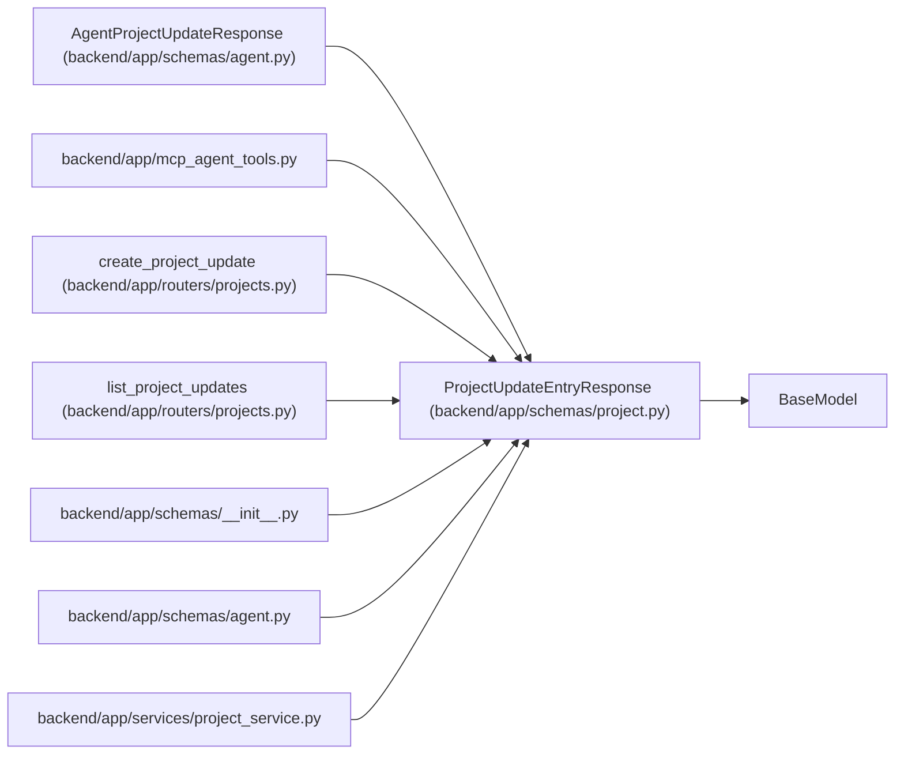

# ProjectUpdateEntryResponse

**Location:** `backend/app/schemas/project.py:160`
**Kind:** Pydantic model
**Bases:** `BaseModel`
**Module:** [schemas_project](../modules/schemas_project.md)

## Description

Schema for project update responses.

## Model Configuration

| Setting | Value | Source |
|---------|-------|--------|
| `from_attributes` | `True` | model_config |

## Attributes

| Name | Type | Wire name | Required | Nullable | Default | Constraints | Examples | Description |
|------|------|-----------|----------|----------|---------|-------------|-------------|----------|
| `id` | `int` | `id` | Yes | No | — | — | — | — |
| `project_id` | `int` | `project_id` | Yes | No | — | — | — | — |
| `health` | `str` | `health` | Yes | No | — | — | — | — |
| `summary` | `str` | `summary` | Yes | No | — | — | — | — |
| `progress_text` | `Optional[str]` | `progress_text` | No | Yes | `None` | — | — | — |
| `risks_text` | `Optional[str]` | `risks_text` | No | Yes | `None` | — | — | — |
| `decisions_text` | `Optional[str]` | `decisions_text` | No | Yes | `None` | — | — | — |
| `next_steps_text` | `Optional[str]` | `next_steps_text` | No | Yes | `None` | — | — | — |
| `created_by_session_id` | `Optional[int]` | `created_by_session_id` | No | Yes | `None` | — | — | — |
| `created_by_actor_id` | `Optional[int]` | `created_by_actor_id` | No | Yes | `None` | — | — | — |
| `evidence_json` | `dict[str, Any]` | `evidence_json` | No | No | factory: `dict` | — | — | — |
| `correlation_id` | `Optional[str]` | `correlation_id` | No | Yes | `None` | — | — | — |
| `idempotency_key` | `Optional[str]` | `idempotency_key` | No | Yes | `None` | — | — | — |
| `created_at` | `datetime` | `created_at` | Yes | No | — | — | — | — |

## Methods

*No public methods. Inherits from base classes.*

## Relationships

<!-- Auto-generated relationship summary. Do not edit by hand. -->

### Summary

| Module | Methods | Attributes |
|---|---:|---|
| [schemas_project](../modules/schemas_project.md) | 0 | `correlation_id`, `created_at`, `created_by_actor_id`, `created_by_session_id`, `decisions_text`, `evidence_json`, `health`, `id`, `idempotency_key`, `next_steps_text`, `progress_text`, `project_id` |

### Structure

| Kind | Entity | Module |
|---|---|---|
| Base | `BaseModel` | — |
| Subclass | `AgentProjectUpdateResponse` | [schemas_agent](../modules/schemas_agent.md) |

### References

| Reference | Kind | Source | Call sites |
|---|---|---|---:|
| `mcp_agent_tools` | import | [mcp_agent_tools](../modules/mcp_agent_tools.md) | — |
| `create_project_update` | type_reference | [projects](../modules/projects.md) | — |
| `list_project_updates` | type_reference | [projects](../modules/projects.md) | — |
| `__init__` | import | [schemas___init__](../modules/schemas___init__.md) | — |
| `agent` | import | [schemas_agent](../modules/schemas_agent.md) | — |
| `project_service` | import | [project_service](../modules/project_service.md) | — |
