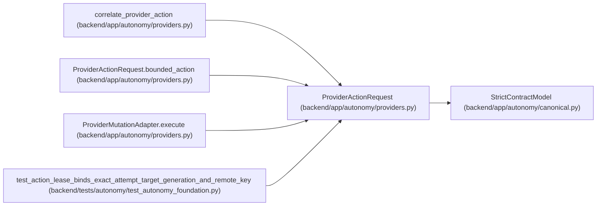

# ProviderActionRequest

**Location:** `backend/app/autonomy/providers.py:24`
**Kind:** Pydantic model
**Bases:** `StrictContractModel`
**Module:** [providers](../modules/providers.md)

## Description

Exact mutation request; adapter selection remains charter-owned.

## Validators

| Method | Scope | Fields | Mode | Options |
|--------|-------|--------|------|---------|
| `bounded_action` | model | — | after | — |

## Attributes

| Name | Type | Wire name | Required | Nullable | Default | Constraints | Examples | Description |
|------|------|-----------|----------|----------|---------|-------------|-------------|----------|
| `domain` | `Literal['platform', 'database', 'application', 'security', 'sanitization', 'retention']` | `domain` | Yes | No | — | — | — | — |
| `operation` | `str` | `operation` | Yes | No | — | max_length=255; min_length=1 | — | — |
| `resource_ref` | `str` | `resource_ref` | Yes | No | — | max_length=2048; pattern=unknown (OPAQUE_REF_PATTERN) | — | — |
| `resource_generation` | `str` | `resource_generation` | Yes | No | — | max_length=255; min_length=1 | — | — |
| `environment` | `Literal['ephemeral', 'rehearsal', 'production']` | `environment` | Yes | No | — | — | — | — |
| `destructive` | `bool` | `destructive` | No | No | `False` | — | — | — |
| `exact_object_digest` | `str \| None` | `exact_object_digest` | No | Yes | `None` | pattern=unknown (SHA256_PATTERN) | — | — |
| `lease` | `SignedActionLease` | `lease` | Yes | No | — | — | — | — |

## Methods

| Method | Signature | Decorators | Description |
|--------|-----------|------------|-------------|
| `bounded_action` | `() -> 'ProviderActionRequest'` | `@model_validator(mode='after')` | — |

## Relationships

<!-- Auto-generated relationship summary. Do not edit by hand. -->

### Summary

| Module | Methods | Attributes |
|---|---:|---|
| [providers](../modules/providers.md) | 1 | `destructive`, `domain`, `environment`, `exact_object_digest`, `lease`, `operation`, `resource_generation`, `resource_ref` |

### Structure

| Kind | Entity | Module |
|---|---|---|
| Base | `StrictContractModel` | [autonomy_canonical](../modules/autonomy_canonical.md) |

### References

| Reference | Kind | Source | Call sites |
|---|---|---|---:|
| `correlate_provider_action` | type_reference | [providers](../modules/providers.md) | — |
| `ProviderActionRequest.bounded_action` | type_reference | [providers](../modules/providers.md) | — |
| `ProviderMutationAdapter.execute` | type_reference | [providers](../modules/providers.md) | — |
| `test_action_lease_binds_exact_attempt_target_generation_and_remote_key` | call | [test_autonomy_foundation](../modules/test_autonomy_foundation.md) | 1 |
