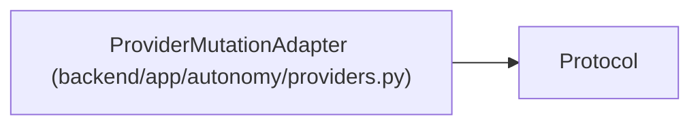

# ProviderMutationAdapter

**Location:** `backend/app/autonomy/providers.py:139`
**Kind:** Class
**Bases:** `Protocol`
**Module:** [providers](../modules/providers.md)

**Decorators:** `@runtime_checkable`

## Description

_Auto-generated from `ProviderMutationAdapter` in `backend/app/autonomy/providers.py`._

## Attributes

*No annotated attributes found.*

## Methods

| Method | Signature | Decorators | Description |
|--------|-----------|------------|-------------|
| `execute` | `(request: ProviderActionRequest) -> ProviderMutationReceipt` | — | — |

## Relationships

<!-- Auto-generated relationship summary. Do not edit by hand. -->

### Summary

| Module | Methods | Attributes |
|---|---:|---|
| [providers](../modules/providers.md) | 1 | — |

### Structure

| Kind | Entity | Module |
|---|---|---|
| Base | `Protocol` | — |
