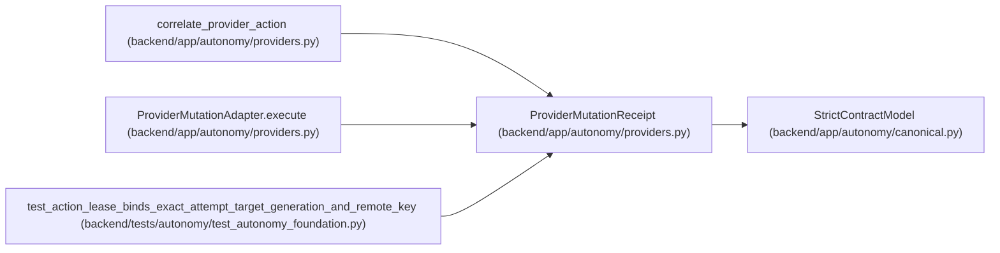

# ProviderMutationReceipt

**Location:** `backend/app/autonomy/providers.py:70`
**Kind:** Pydantic model
**Bases:** `StrictContractModel`
**Module:** [providers](../modules/providers.md)

## Description

Adapter response only; it cannot establish acceptance by itself.

## Validators

| Method | Scope | Fields | Mode | Options |
|--------|-------|--------|------|---------|
| `aware_response_time` | field | response_received_at | after | — |

## Attributes

| Name | Type | Wire name | Required | Nullable | Default | Constraints | Examples | Description |
|------|------|-----------|----------|----------|---------|-------------|-------------|----------|
| `schema_version` | `Literal['workchord-provider-mutation-receipt-v1']` | `schema_version` | No | No | `'workchord-provider-mutation-receipt-v1'` | — | — | — |
| `lease_digest` | `str` | `lease_digest` | Yes | No | — | pattern=unknown (SHA256_PATTERN) | — | — |
| `domain` | `str` | `domain` | Yes | No | — | pattern=unknown (IDENTIFIER_PATTERN) | — | — |
| `operation` | `str` | `operation` | Yes | No | — | max_length=255; min_length=1 | — | — |
| `resource_ref` | `str` | `resource_ref` | Yes | No | — | max_length=2048; pattern=unknown (OPAQUE_REF_PATTERN) | — | — |
| `resource_generation_before` | `str` | `resource_generation_before` | Yes | No | — | max_length=255; min_length=1 | — | — |
| `resource_generation_after` | `str` | `resource_generation_after` | Yes | No | — | max_length=255; min_length=1 | — | — |
| `provider_request_id` | `str` | `provider_request_id` | Yes | No | — | max_length=512; min_length=1 | — | — |
| `response_received_at` | `datetime` | `response_received_at` | Yes | No | — | — | — | — |
| `raw_response_uri` | `str` | `raw_response_uri` | Yes | No | — | max_length=2048; pattern=unknown (OPAQUE_REF_PATTERN) | — | — |
| `raw_response_sha256` | `str` | `raw_response_sha256` | Yes | No | — | pattern=unknown (SHA256_PATTERN) | — | — |
| `tls_peer_identity_digest` | `str` | `tls_peer_identity_digest` | Yes | No | — | pattern=unknown (SHA256_PATTERN) | — | — |

## Methods

| Method | Signature | Decorators | Description |
|--------|-----------|------------|-------------|
| `aware_response_time` | `(value: datetime) -> datetime` | `@field_validator('response_received_at')`, `@classmethod` | — |

## Relationships

<!-- Auto-generated relationship summary. Do not edit by hand. -->

### Summary

| Module | Methods | Attributes |
|---|---:|---|
| [providers](../modules/providers.md) | 1 | `domain`, `lease_digest`, `operation`, `provider_request_id`, `raw_response_sha256`, `raw_response_uri`, `resource_generation_after`, `resource_generation_before`, `resource_ref`, `response_received_at`, `schema_version`, `tls_peer_identity_digest` |

### Structure

| Kind | Entity | Module |
|---|---|---|
| Base | `StrictContractModel` | [autonomy_canonical](../modules/autonomy_canonical.md) |

### References

| Reference | Kind | Source | Call sites |
|---|---|---|---:|
| `correlate_provider_action` | type_reference | [providers](../modules/providers.md) | — |
| `ProviderMutationAdapter.execute` | type_reference | [providers](../modules/providers.md) | — |
| `test_action_lease_binds_exact_attempt_target_generation_and_remote_key` | call | [test_autonomy_foundation](../modules/test_autonomy_foundation.md) | 1 |
