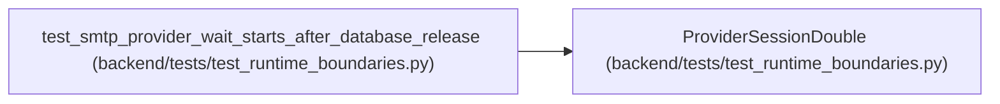

# ProviderSessionDouble

**Location:** `backend/tests/test_runtime_boundaries.py:373`
**Kind:** Class
**Bases:** —
**Module:** [test_runtime_boundaries](../modules/test_runtime_boundaries.md)

## Description

_Auto-generated from `ProviderSessionDouble` in `backend/tests/test_runtime_boundaries.py`._

## Attributes

*No annotated attributes found.*

## Methods

| Method | Signature | Decorators | Description |
|--------|-----------|------------|-------------|
| `__init__` | `() -> None` | — | — |
| `commit` | *(async)* `() -> None` | — | — |

## Relationships

<!-- Auto-generated relationship summary. Do not edit by hand. -->

### Summary

| Module | Methods | Attributes |
|---|---:|---|
| [test_runtime_boundaries](../modules/test_runtime_boundaries.md) | 2 | — |

### References

| Reference | Kind | Source | Call sites |
|---|---|---|---:|
| `test_smtp_provider_wait_starts_after_database_release` | call | [test_runtime_boundaries](../modules/test_runtime_boundaries.md) | 1 |
