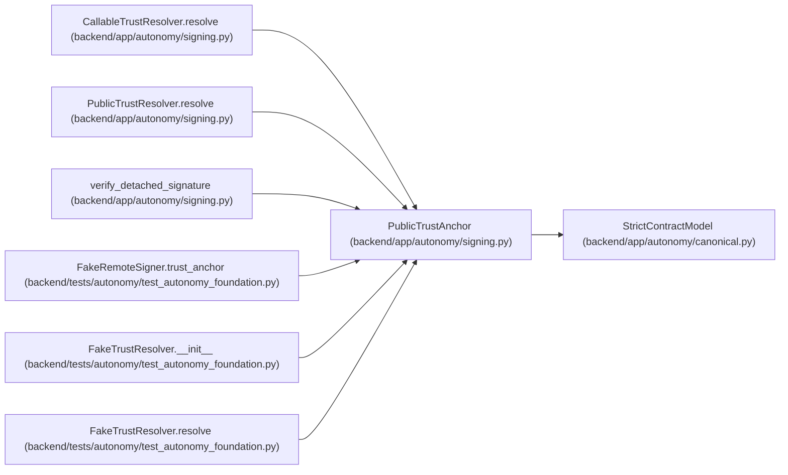

# PublicTrustAnchor

**Location:** `backend/app/autonomy/signing.py:48`
**Kind:** Pydantic model
**Bases:** `StrictContractModel`
**Module:** [signing](../modules/signing.md)

## Description

A public key returned by a separately trusted resolver.

## Validators

| Method | Scope | Fields | Mode | Options |
|--------|-------|--------|------|---------|
| `public_key_only` | field | public_key_pem | after | — |

## Attributes

| Name | Type | Wire name | Required | Nullable | Default | Constraints | Examples | Description |
|------|------|-----------|----------|----------|---------|-------------|-------------|----------|
| `key_ref` | `str` | `key_ref` | Yes | No | — | max_length=512; pattern=unknown (KEY_REF_PATTERN) | — | — |
| `key_version` | `str` | `key_version` | Yes | No | — | max_length=255; min_length=1 | — | — |
| `issuer` | `str` | `issuer` | Yes | No | — | max_length=255; min_length=1 | — | — |
| `allowed_subjects` | `tuple[str, ...]` | `allowed_subjects` | Yes | No | — | max_length=256; min_length=1 | — | — |
| `algorithm` | `Literal['ed25519', 'ecdsa-p256-sha256', 'rsa-pss-sha256']` | `algorithm` | Yes | No | — | — | — | — |
| `public_key_pem` | `str` | `public_key_pem` | Yes | No | — | max_length=16384; min_length=64 | — | — |
| `source_receipt_digest` | `str` | `source_receipt_digest` | Yes | No | — | pattern=unknown (SHA256_PATTERN) | — | — |

## Methods

| Method | Signature | Decorators | Description |
|--------|-----------|------------|-------------|
| `public_key_only` | `(value: str) -> str` | `@field_validator('public_key_pem')`, `@classmethod` | — |

## Relationships

<!-- Auto-generated relationship summary. Do not edit by hand. -->

### Summary

| Module | Methods | Attributes |
|---|---:|---|
| [signing](../modules/signing.md) | 1 | `algorithm`, `allowed_subjects`, `issuer`, `key_ref`, `key_version`, `public_key_pem`, `source_receipt_digest` |

### Structure

| Kind | Entity | Module |
|---|---|---|
| Base | `StrictContractModel` | [autonomy_canonical](../modules/autonomy_canonical.md) |

### References

| Reference | Kind | Source | Call sites |
|---|---|---|---:|
| `CallableTrustResolver.resolve` | type_reference | [signing](../modules/signing.md) | — |
| `PublicTrustResolver.resolve` | type_reference | [signing](../modules/signing.md) | — |
| `verify_detached_signature` | type_reference | [signing](../modules/signing.md) | — |
| `FakeRemoteSigner.trust_anchor` | call | [test_autonomy_foundation](../modules/test_autonomy_foundation.md) | 1 |
| `FakeRemoteSigner.trust_anchor` | type_reference | [test_autonomy_foundation](../modules/test_autonomy_foundation.md) | — |
| `FakeTrustResolver.__init__` | type_reference | [test_autonomy_foundation](../modules/test_autonomy_foundation.md) | — |
| `FakeTrustResolver.resolve` | type_reference | [test_autonomy_foundation](../modules/test_autonomy_foundation.md) | — |
