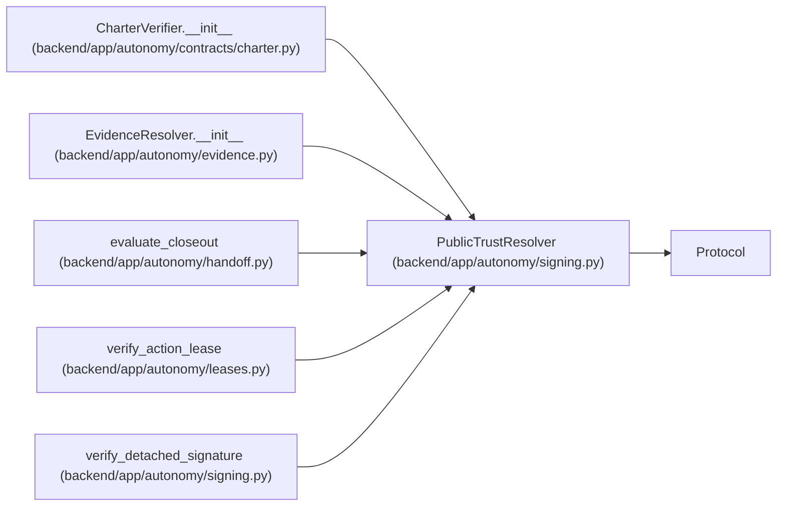

# PublicTrustResolver

**Location:** `backend/app/autonomy/signing.py:70`
**Kind:** Class
**Bases:** `Protocol`
**Module:** [signing](../modules/signing.md)

**Decorators:** `@runtime_checkable`

## Description

Resolve a current public key from an external trust source.

## Attributes

*No annotated attributes found.*

## Methods

| Method | Signature | Decorators | Description |
|--------|-----------|------------|-------------|
| `resolve` | `(*, key_ref: str, key_version: str) -> PublicTrustAnchor` | — | — |

## Relationships

<!-- Auto-generated relationship summary. Do not edit by hand. -->

### Summary

| Module | Methods | Attributes |
|---|---:|---|
| [signing](../modules/signing.md) | 1 | — |

### Structure

| Kind | Entity | Module |
|---|---|---|
| Base | `Protocol` | — |

### References

| Reference | Kind | Source | Call sites |
|---|---|---|---:|
| `CharterVerifier.__init__` | type_reference | [charter](../modules/charter.md) | — |
| `EvidenceResolver.__init__` | type_reference | [evidence](../modules/evidence.md) | — |
| `evaluate_closeout` | type_reference | [handoff](../modules/handoff.md) | — |
| `verify_action_lease` | type_reference | [leases](../modules/leases.md) | — |
| `verify_detached_signature` | type_reference | [signing](../modules/signing.md) | — |
