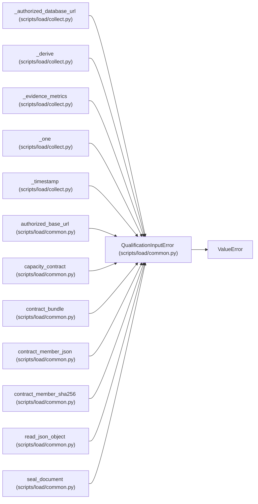

# QualificationInputError

**Location:** `scripts/load/common.py:34`
**Kind:** Class
**Bases:** `ValueError`
**Module:** [load_common](../modules/load_common.md)

## Description

A workload or evidence input is unsafe, stale, or incomplete.

## Attributes

*No annotated attributes found.*

## Methods

*No public methods. Inherits from base classes.*

## Relationships

<!-- Auto-generated relationship summary. Do not edit by hand. -->

### Summary

| Module | Methods | Attributes |
|---|---:|---|
| [load_common](../modules/load_common.md) | 0 | — |

### Structure

| Kind | Entity | Module |
|---|---|---|
| Base | `ValueError` | — |

### References

| Reference | Kind | Source | Call sites |
|---|---|---|---:|
| `_authorized_database_url` | call | [collect](../modules/collect.md) | 5 |
| `_derive` | call | [collect](../modules/collect.md) | 9 |
| `_evidence_metrics` | call | [collect](../modules/collect.md) | 2 |
| `_one` | call | [collect](../modules/collect.md) | 1 |
| `_timestamp` | call | [collect](../modules/collect.md) | 1 |
| `authorized_base_url` | call | [load_common](../modules/load_common.md) | 6 |
| `capacity_contract` | call | [load_common](../modules/load_common.md) | 1 |
| `contract_bundle` | call | [load_common](../modules/load_common.md) | 1 |
| `contract_member_json` | call | [load_common](../modules/load_common.md) | 2 |
| `contract_member_sha256` | call | [load_common](../modules/load_common.md) | 1 |
| `read_json_object` | call | [load_common](../modules/load_common.md) | 2 |
| `seal_document` | call | [load_common](../modules/load_common.md) | 1 |

> References: showing 12 of 57 logical references; 45 omitted by the 12-row generated summary limit.
