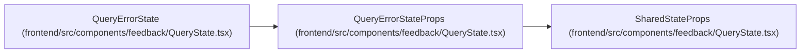

# QueryErrorStateProps

**Location:** `frontend/src/components/feedback/QueryState.tsx:15`
**Kind:** Class
**Bases:** `SharedStateProps`
**Module:** [QueryState](../modules/QueryState.md)

## Description

_Auto-generated from `QueryErrorStateProps` in `frontend/src/components/feedback/QueryState.tsx`._

## Attributes

| Name | Type | Default | Description |
|------|------|---------|-------------|
| `error` | `unknown` | *required* | — |
| `fallback` | `string` | *required* | — |
| `headingLevel` | `2 \| 3` | *required* | — |
| `isRetrying` | `boolean` | *required* | — |
| `message` | `string` | *required* | — |
| `onRetry` | `() => void` | *required* | — |
| `retryButtonRef` | `Ref<HTMLButtonElement>` | *required* | — |
| `retryLabel` | `string` | *required* | — |
| `title` | `string` | *required* | — |

## Methods

*No public methods. Inherits from base classes.*

## Relationships

<!-- Auto-generated relationship summary. Do not edit by hand. -->

### Summary

| Module | Methods | Attributes |
|---|---:|---|
| [QueryState](../modules/QueryState.md) | 0 | `error`, `fallback`, `headingLevel`, `isRetrying`, `message`, `onRetry`, `retryButtonRef`, `retryLabel`, `title` |

### Structure

| Kind | Entity | Module |
|---|---|---|
| Base | `SharedStateProps` | [QueryState](../modules/QueryState.md) |

### References

| Reference | Kind | Source | Call sites |
|---|---|---|---:|
| `QueryErrorState` | type_reference | [QueryState](../modules/QueryState.md) | — |
