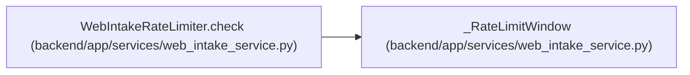

# _RateLimitWindow

**Location:** `backend/app/services/web_intake_service.py:38`
**Kind:** Class
**Bases:** —
**Module:** [web_intake_service](../modules/web_intake_service.md)

**Decorators:** `@dataclass`

## Description

_Auto-generated from `_RateLimitWindow` in `backend/app/services/web_intake_service.py`._

## Attributes

| Name | Type | Default | Description |
|------|------|---------|-------------|
| `window_started_at` | `float` | *required* | — |
| `count` | `int` | *required* | — |

## Methods

*No public methods. Inherits from base classes.*

## Relationships

<!-- Auto-generated relationship summary. Do not edit by hand. -->

### Summary

| Module | Methods | Attributes |
|---|---:|---|
| [web_intake_service](../modules/web_intake_service.md) | 0 | `count`, `window_started_at` |

### References

| Reference | Kind | Source | Call sites |
|---|---|---|---:|
| `WebIntakeRateLimiter.check` | call | [web_intake_service](../modules/web_intake_service.md) | 1 |
