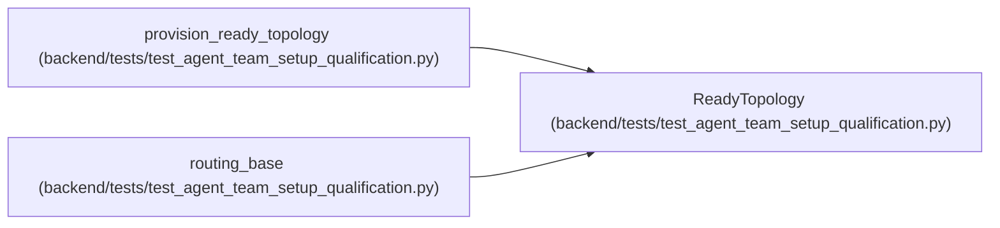

# ReadyTopology

**Location:** `backend/tests/test_agent_team_setup_qualification.py:328`
**Kind:** Class
**Bases:** —
**Module:** [test_agent_team_setup_qualification](../modules/test_agent_team_setup_qualification.md)

**Decorators:** `@dataclass(frozen=True)`

## Description

_Auto-generated from `ReadyTopology` in `backend/tests/test_agent_team_setup_qualification.py`._

## Attributes

| Name | Type | Default | Description |
|------|------|---------|-------------|
| `manifest` | `AgentTeamMaster` | *required* | — |
| `sink` | `CapturingCredentialSink` | *required* | — |
| `service` | `AgentTeamSetupService` | *required* | — |
| `actors` | `dict[str, AgentActor]` | *required* | — |

## Methods

*No public methods. Inherits from base classes.*

## Relationships

<!-- Auto-generated relationship summary. Do not edit by hand. -->

### Summary

| Module | Methods | Attributes |
|---|---:|---|
| [test_agent_team_setup_qualification](../modules/test_agent_team_setup_qualification.md) | 0 | `actors`, `manifest`, `service`, `sink` |

### References

| Reference | Kind | Source | Call sites |
|---|---|---|---:|
| `provision_ready_topology` | call | [test_agent_team_setup_qualification](../modules/test_agent_team_setup_qualification.md) | 1 |
| `provision_ready_topology` | type_reference | [test_agent_team_setup_qualification](../modules/test_agent_team_setup_qualification.md) | — |
| `routing_base` | type_reference | [test_agent_team_setup_qualification](../modules/test_agent_team_setup_qualification.md) | — |
