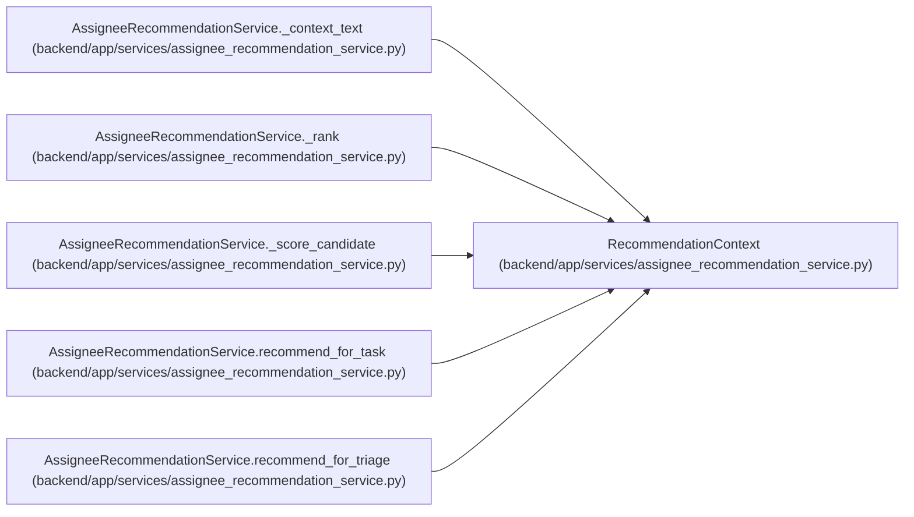

# RecommendationContext

**Location:** `backend/app/services/assignee_recommendation_service.py:23`
**Kind:** Class
**Bases:** —
**Module:** [assignee_recommendation_service](../modules/assignee_recommendation_service.md)

**Decorators:** `@dataclass`

## Description

Normalized work item context for assignee recommendation scoring.

## Attributes

| Name | Type | Default | Description |
|------|------|---------|-------------|
| `title` | `str` | *required* | — |
| `description` | `Optional[str]` | `None` | — |
| `labels` | `list[str] \| None` | `None` | — |
| `source` | `Optional[str]` | `None` | — |
| `external_key` | `Optional[str]` | `None` | — |
| `assignee_hint` | `Optional[str]` | `None` | — |
| `project_name` | `Optional[str]` | `None` | — |
| `priority` | `Optional[int]` | `None` | — |
| `start_date` | `Optional[date]` | `None` | — |
| `end_date` | `Optional[date]` | `None` | — |
| `current_assignee_id` | `Optional[int]` | `None` | — |

## Methods

*No public methods. Inherits from base classes.*

## Relationships

<!-- Auto-generated relationship summary. Do not edit by hand. -->

### Summary

| Module | Methods | Attributes |
|---|---:|---|
| [assignee_recommendation_service](../modules/assignee_recommendation_service.md) | 0 | `assignee_hint`, `current_assignee_id`, `description`, `end_date`, `external_key`, `labels`, `priority`, `project_name`, `source`, `start_date`, `title` |

### References

| Reference | Kind | Source | Call sites |
|---|---|---|---:|
| `AssigneeRecommendationService._context_text` | type_reference | [assignee_recommendation_service](../modules/assignee_recommendation_service.md) | — |
| `AssigneeRecommendationService._rank` | type_reference | [assignee_recommendation_service](../modules/assignee_recommendation_service.md) | — |
| `AssigneeRecommendationService._score_candidate` | type_reference | [assignee_recommendation_service](../modules/assignee_recommendation_service.md) | — |
| `AssigneeRecommendationService.recommend_for_task` | call | [assignee_recommendation_service](../modules/assignee_recommendation_service.md) | 1 |
| `AssigneeRecommendationService.recommend_for_triage` | call | [assignee_recommendation_service](../modules/assignee_recommendation_service.md) | 1 |
