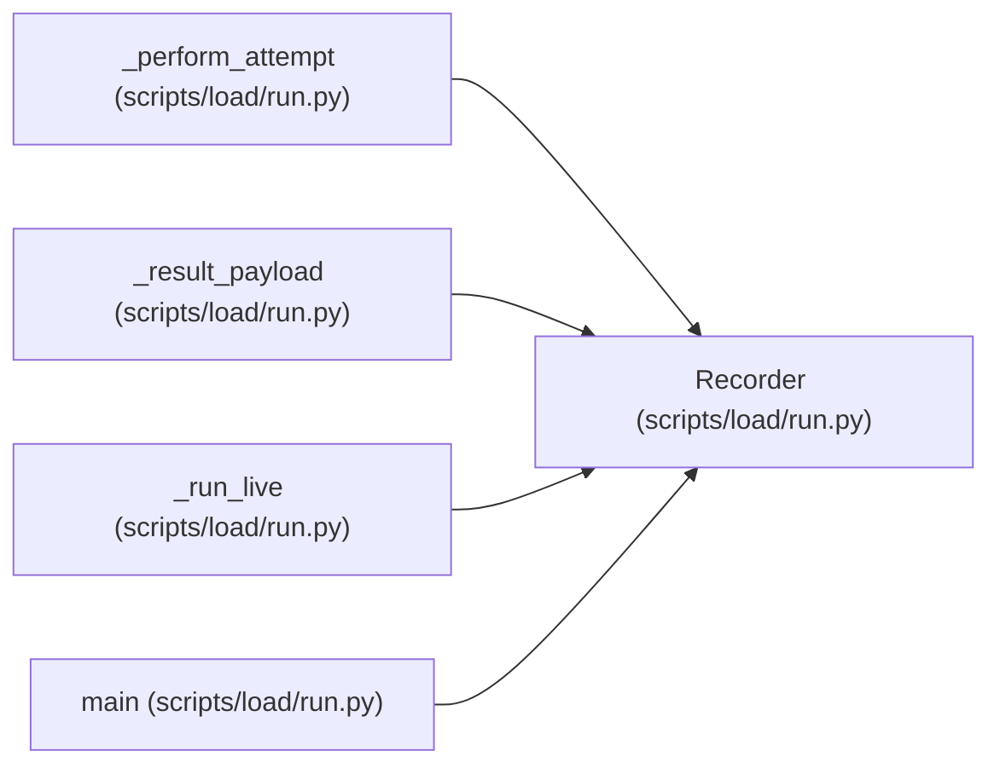

# Recorder

**Location:** `scripts/load/run.py:84`
**Kind:** Class
**Bases:** —
**Module:** [run](../modules/run.md)

**Decorators:** `@dataclass`

## Description

_Auto-generated from `Recorder` in `scripts/load/run.py`._

## Attributes

| Name | Type | Default | Description |
|------|------|---------|-------------|
| `attempts` | `list[Attempt]` | `field(default_factory=list)` | — |
| `errors` | `list[dict[str, str]]` | `field(default_factory=list)` | — |
| `in_flight` | `int` | `0` | — |
| `in_flight_peak` | `int` | `0` | — |
| `open_connections_peak` | `int` | `0` | — |
| `session_state_counts` | `Counter[str]` | `field(default_factory=Counter)` | — |
| `client_last_started` | `dict[str, float]` | `field(default_factory=dict)` | — |
| `client_intervals` | `dict[str, list[float]]` | `field(default_factory=lambda: defaultdict(list))` | — |
| `poll_guidance_responses` | `int` | `0` | — |
| `poll_guidance_parsed` | `int` | `0` | — |
| `poll_guidance_respected` | `int` | `0` | — |
| `poll_guidance_outstanding` | `int` | `0` | — |
| `logical_attempts_completed` | `int` | `0` | — |
| `retry_attempts` | `int` | `0` | — |
| `retry_exhausted` | `int` | `0` | — |
| `physical_attempts_per_logical_peak` | `int` | `0` | — |
| `connection_ramp_seconds` | `float \| None` | `None` | — |

## Methods

| Method | Signature | Decorators | Description |
|--------|-----------|------------|-------------|
| `begin` | `(client: 'VirtualClient \| None' = None) -> None` | — | — |
| `finish` | `(attempt: Attempt) -> None` | — | — |
| `error` | `(operation_id: str, exc: BaseException) -> None` | — | — |

## Relationships

<!-- Auto-generated relationship summary. Do not edit by hand. -->

### Summary

| Module | Methods | Attributes |
|---|---:|---|
| [run](../modules/run.md) | 3 | `attempts`, `client_intervals`, `client_last_started`, `connection_ramp_seconds`, `errors`, `in_flight`, `in_flight_peak`, `logical_attempts_completed`, `open_connections_peak`, `physical_attempts_per_logical_peak`, `poll_guidance_outstanding`, `poll_guidance_parsed` |

### References

| Reference | Kind | Source | Call sites |
|---|---|---|---:|
| `_perform_attempt` | type_reference | [run](../modules/run.md) | — |
| `_result_payload` | type_reference | [run](../modules/run.md) | — |
| `_run_live` | call | [run](../modules/run.md) | 1 |
| `_run_live` | type_reference | [run](../modules/run.md) | — |
| `main` | call | [run](../modules/run.md) | 1 |
