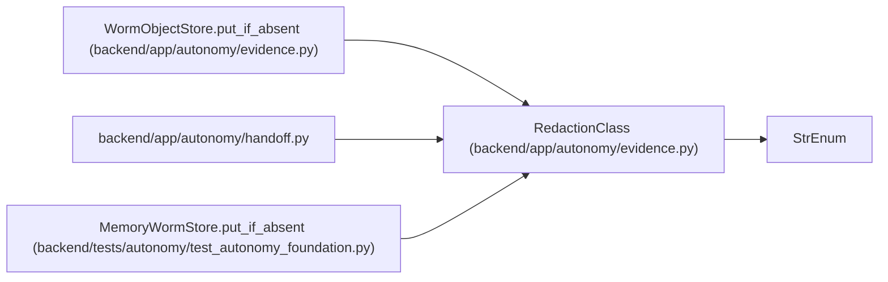

# RedactionClass

**Location:** `backend/app/autonomy/evidence.py:31`
**Kind:** Enum
**Bases:** `StrEnum`
**Module:** [evidence](../modules/evidence.md)

## Description

_Auto-generated from `RedactionClass` in `backend/app/autonomy/evidence.py`._

## Attributes

| Name | Declared value | Description |
|------|-------|-------------|
| `RESTRICTED_TOPOLOGY` | `'restricted-topology'` | — |
| `INTERNAL` | `'internal'` | — |
| `PUBLIC` | `'public'` | — |

## Methods

*No public methods. Inherits from base classes.*

## Relationships

<!-- Auto-generated relationship summary. Do not edit by hand. -->

### Summary

| Module | Methods | Attributes |
|---|---:|---|
| [evidence](../modules/evidence.md) | 0 | `INTERNAL`, `PUBLIC`, `RESTRICTED_TOPOLOGY` |

### Structure

| Kind | Entity | Module |
|---|---|---|
| Base | `StrEnum` | — |

### References

| Reference | Kind | Source | Call sites |
|---|---|---|---:|
| `WormObjectStore.put_if_absent` | type_reference | [evidence](../modules/evidence.md) | — |
| `handoff` | import | [handoff](../modules/handoff.md) | — |
| `MemoryWormStore.put_if_absent` | type_reference | [test_autonomy_foundation](../modules/test_autonomy_foundation.md) | — |
