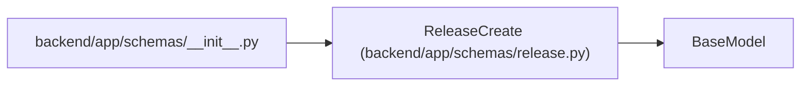

# ReleaseCreate

**Location:** `backend/app/schemas/release.py:31`
**Kind:** Pydantic model
**Bases:** `BaseModel`
**Module:** [schemas_release](../modules/schemas_release.md)

## Description

Schema for creating a release.

## Model Configuration

| Setting | Value | Source |
|---------|-------|--------|
| `extra` | `'forbid'` | model_config |

## Attributes

| Name | Type | Wire name | Required | Nullable | Default | Constraints | Examples | Description |
|------|------|-----------|----------|----------|---------|-------------|-------------|----------|
| `project_id` | `int` | `project_id` | Yes | No | — | — | — | — |
| `name` | `str` | `name` | Yes | No | — | max_length=255; min_length=1 | — | — |
| `description` | `Optional[str]` | `description` | No | Yes | `None` | — | — | — |
| `status` | `ReleaseStatus` | `status` | No | No | `ReleaseStatus.PLANNED` | — | — | — |
| `target_date` | `Optional[date]` | `target_date` | No | Yes | `None` | — | — | — |
| `shipped_at` | `Optional[datetime]` | `shipped_at` | No | Yes | `None` | — | — | — |
| `version` | `Optional[str]` | `version` | No | Yes | `None` | max_length=100 | — | — |
| `environment` | `Optional[str]` | `environment` | No | Yes | `None` | max_length=100 | — | — |
| `task_ids` | `list[int]` | `task_ids` | No | No | factory: `list` | — | — | — |

## Methods

*No public methods. Inherits from base classes.*

## Relationships

<!-- Auto-generated relationship summary. Do not edit by hand. -->

### Summary

| Module | Methods | Attributes |
|---|---:|---|
| [schemas_release](../modules/schemas_release.md) | 0 | `description`, `environment`, `name`, `project_id`, `shipped_at`, `status`, `target_date`, `task_ids`, `version` |

### Structure

| Kind | Entity | Module |
|---|---|---|
| Base | `BaseModel` | — |

### References

| Reference | Kind | Source | Call sites |
|---|---|---|---:|
| `__init__` | import | [schemas___init__](../modules/schemas___init__.md) | — |
