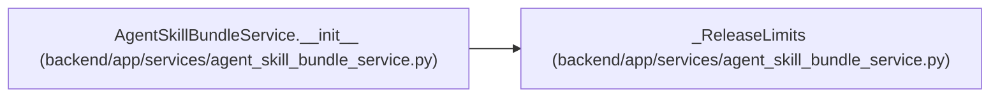

# _ReleaseLimits

**Location:** `backend/app/services/agent_skill_bundle_service.py:89`
**Kind:** Class
**Bases:** —
**Module:** [agent_skill_bundle_service](../modules/agent_skill_bundle_service.md)

**Decorators:** `@dataclass(frozen=True)`

## Description

_Auto-generated from `_ReleaseLimits` in `backend/app/services/agent_skill_bundle_service.py`._

## Attributes

| Name | Type | Default | Description |
|------|------|---------|-------------|
| `max_artifacts` | `int` | *required* | — |
| `max_artifact_bytes` | `int` | *required* | — |
| `max_total_bytes` | `int` | *required* | — |
| `max_metadata_bytes` | `int` | *required* | — |
| `max_file_bytes` | `int` | *required* | — |

## Methods

*No public methods. Inherits from base classes.*

## Relationships

<!-- Auto-generated relationship summary. Do not edit by hand. -->

### Summary

| Module | Methods | Attributes |
|---|---:|---|
| [agent_skill_bundle_service](../modules/agent_skill_bundle_service.md) | 0 | `max_artifact_bytes`, `max_artifacts`, `max_file_bytes`, `max_metadata_bytes`, `max_total_bytes` |

### References

| Reference | Kind | Source | Call sites |
|---|---|---|---:|
| `AgentSkillBundleService.__init__` | call | [agent_skill_bundle_service](../modules/agent_skill_bundle_service.md) | 1 |
