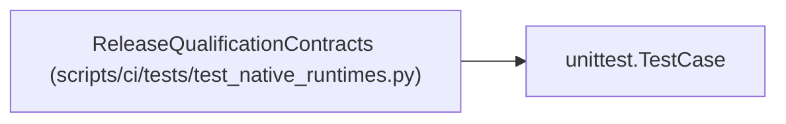

# ReleaseQualificationContracts

**Location:** `scripts/ci/tests/test_native_runtimes.py:373`
**Kind:** Class
**Bases:** `unittest.TestCase`
**Module:** [test_native_runtimes](../modules/test_native_runtimes.md)

## Description

_Auto-generated from `ReleaseQualificationContracts` in `scripts/ci/tests/test_native_runtimes.py`._

## Attributes

*No annotated attributes found.*

## Methods

| Method | Signature | Decorators | Description |
|--------|-----------|------------|-------------|
| `test_qualification_flags_are_explicit_and_paired` | `()` | — | — |
| `test_required_case_parser_rejects_skips_failures_and_missing_cases` | `()` | — | — |
| `test_release_manifest_forbids_cleartext_backup_and_debug` | `()` | — | — |
| `test_inventory_contains_every_declared_live_and_storage_scenario` | `()` | — | — |
| `test_unowned_or_production_inputs_cannot_reach_device_operations` | `()` | — | — |

## Relationships

<!-- Auto-generated relationship summary. Do not edit by hand. -->

### Summary

| Module | Methods | Attributes |
|---|---:|---|
| [test_native_runtimes](../modules/test_native_runtimes.md) | 5 | — |

### Structure

| Kind | Entity | Module |
|---|---|---|
| Base | `unittest.TestCase` | — |
