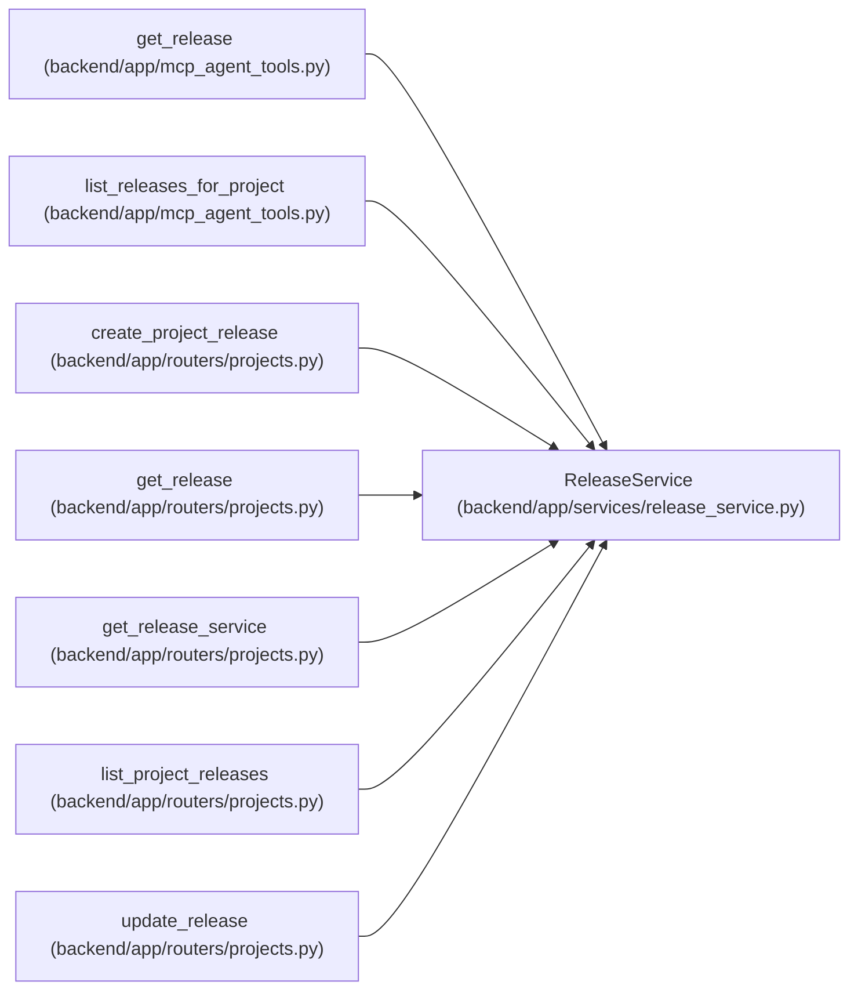

# ReleaseService

**Location:** `backend/app/services/release_service.py:25`
**Kind:** Class
**Bases:** —
**Module:** [release_service](../modules/release_service.md)

## Description

Service for release CRUD and task link validation.

## Attributes

*No annotated attributes found.*

## Methods

| Method | Signature | Decorators | Description |
|--------|-----------|------------|-------------|
| `__init__` | `(db: AsyncSession)` | — | — |
| `_enum_value` | `(value)` | — | Normalize Pydantic enum values before assigning to string columns. |
| `_release_options` | `() -> tuple` | — | Return release relationship loading options used by responses. |
| `_is_shipped` | `(release: Release) -> bool` | — | Return whether a release is currently in shipped state. |
| `_release_shipped_idempotency_key` | `(release_id: int, task_id: int) -> str` | — | Build the stable idempotency key for one release/task shipped signal. |
| `_event_exists` | *(async)* `(idempotency_key: str) -> bool` | — | Return whether a task event idempotency key has already been recorded. |
| `_release_shipped_payload` | `(release: Release) -> dict` | — | Build the task timeline payload for a shipped release. |
| `_emit_release_shipped_events` | *(async)* `(release: Release) -> None` | — | Emit missing shipped events for linked release tasks. |
| `_project_exists` | *(async)* `(project_id: int) -> bool` | — | Return whether a project exists. |
| `_attach_work_metrics` | *(async)* `(release, tasks = None)` | — | — |
| `get_by_id` | *(async)* `(release_id: int) -> Optional[Release]` | — | Get a release with linked tasks loaded. |
| `list_for_project` | *(async)* `(project_id: int) -> Optional[Sequence[Release]]` | — | List releases for a project in project-release order. |
| `_validate_task_ids` | *(async)* `(project_id: int, task_ids: Sequence[int]) -> list[Task]` | — | Validate that all task IDs exist once and belong to the release project. |
| `create_for_project` | *(async)* `(project_id: int, data: ReleaseCreateRequest) -> Optional[Release]` | — | Create a release for a project. |
| `update` | *(async)* `(release_id: int, data: ReleaseUpdateRequest) -> Optional[Release]` | — | Apply a partial release update. |

## Relationships

<!-- Auto-generated relationship summary. Do not edit by hand. -->

### Summary

| Module | Methods | Attributes |
|---|---:|---|
| [release_service](../modules/release_service.md) | 15 | — |

### References

| Reference | Kind | Source | Call sites |
|---|---|---|---:|
| `get_release` | call | [mcp_agent_tools](../modules/mcp_agent_tools.md) | 1 |
| `list_releases_for_project` | call | [mcp_agent_tools](../modules/mcp_agent_tools.md) | 1 |
| `create_project_release` | type_reference | [projects](../modules/projects.md) | — |
| `get_release` | type_reference | [projects](../modules/projects.md) | — |
| `get_release_service` | call | [projects](../modules/projects.md) | 1 |
| `get_release_service` | type_reference | [projects](../modules/projects.md) | — |
| `list_project_releases` | type_reference | [projects](../modules/projects.md) | — |
| `update_release` | type_reference | [projects](../modules/projects.md) | — |
