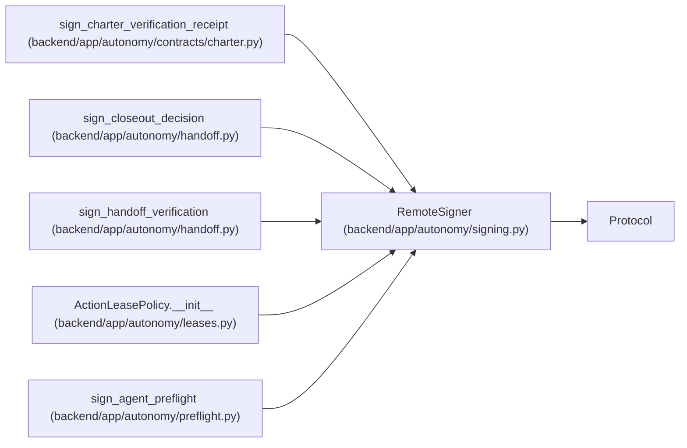

# RemoteSigner

**Location:** `backend/app/autonomy/signing.py:77`
**Kind:** Class
**Bases:** `Protocol`
**Module:** [signing](../modules/signing.md)

**Decorators:** `@runtime_checkable`

## Description

Sign a digest through a non-exportable external key service.

## Attributes

*No annotated attributes found.*

## Methods

| Method | Signature | Decorators | Description |
|--------|-----------|------------|-------------|
| `sign_digest` | `(*, payload_sha256: str, key_ref: str, subject: str) -> DetachedSignatureEnvelope` | — | — |

## Relationships

<!-- Auto-generated relationship summary. Do not edit by hand. -->

### Summary

| Module | Methods | Attributes |
|---|---:|---|
| [signing](../modules/signing.md) | 1 | — |

### Structure

| Kind | Entity | Module |
|---|---|---|
| Base | `Protocol` | — |

### References

| Reference | Kind | Source | Call sites |
|---|---|---|---:|
| `sign_charter_verification_receipt` | type_reference | [charter](../modules/charter.md) | — |
| `sign_closeout_decision` | type_reference | [handoff](../modules/handoff.md) | — |
| `sign_handoff_verification` | type_reference | [handoff](../modules/handoff.md) | — |
| `ActionLeasePolicy.__init__` | type_reference | [leases](../modules/leases.md) | — |
| `sign_agent_preflight` | type_reference | [preflight](../modules/preflight.md) | — |
