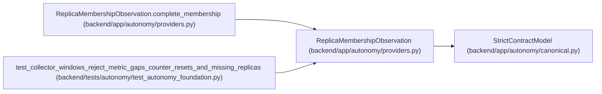

# ReplicaMembershipObservation

**Location:** `backend/app/autonomy/providers.py:268`
**Kind:** Pydantic model
**Bases:** `StrictContractModel`
**Module:** [providers](../modules/providers.md)

## Description

_Auto-generated from `ReplicaMembershipObservation` in `backend/app/autonomy/providers.py`._

## Validators

| Method | Scope | Fields | Mode | Options |
|--------|-------|--------|------|---------|
| `complete_membership` | model | — | after | — |

## Attributes

| Name | Type | Wire name | Required | Nullable | Default | Constraints | Examples | Description |
|------|------|-----------|----------|----------|---------|-------------|-------------|----------|
| `expected_members` | `tuple[str, ...]` | `expected_members` | Yes | No | — | max_length=1024; min_length=1 | — | — |
| `observed_members` | `tuple[str, ...]` | `observed_members` | Yes | No | — | max_length=1024; min_length=1 | — | — |
| `scheduler_membership_digest` | `str` | `scheduler_membership_digest` | Yes | No | — | pattern=unknown (SHA256_PATTERN) | — | — |
| `connection_ownership_digest` | `str` | `connection_ownership_digest` | Yes | No | — | pattern=unknown (SHA256_PATTERN) | — | — |

## Methods

| Method | Signature | Decorators | Description |
|--------|-----------|------------|-------------|
| `complete_membership` | `() -> 'ReplicaMembershipObservation'` | `@model_validator(mode='after')` | — |

## Relationships

<!-- Auto-generated relationship summary. Do not edit by hand. -->

### Summary

| Module | Methods | Attributes |
|---|---:|---|
| [providers](../modules/providers.md) | 1 | `connection_ownership_digest`, `expected_members`, `observed_members`, `scheduler_membership_digest` |

### Structure

| Kind | Entity | Module |
|---|---|---|
| Base | `StrictContractModel` | [autonomy_canonical](../modules/autonomy_canonical.md) |

### References

| Reference | Kind | Source | Call sites |
|---|---|---|---:|
| `ReplicaMembershipObservation.complete_membership` | type_reference | [providers](../modules/providers.md) | — |
| `test_collector_windows_reject_metric_gaps_counter_resets_and_missing_replicas` | call | [test_autonomy_foundation](../modules/test_autonomy_foundation.md) | 1 |
