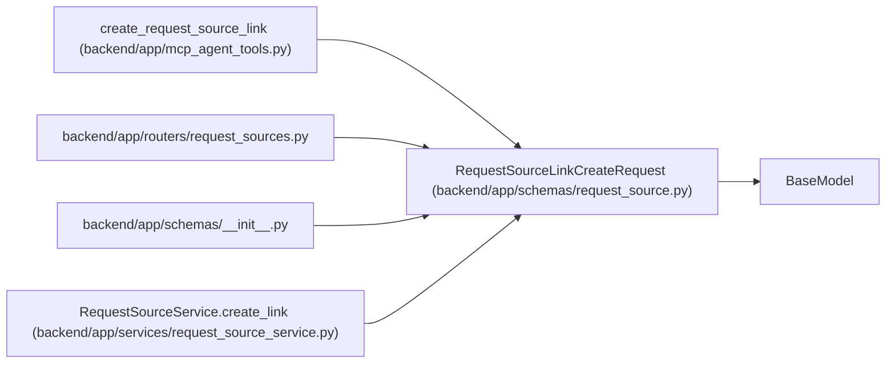

# RequestSourceLinkCreateRequest

**Location:** `backend/app/schemas/request_source.py:128`
**Kind:** Pydantic model
**Bases:** `BaseModel`
**Module:** [schemas_request_source](../modules/schemas_request_source.md)

## Description

API request for linking an existing or new request source to a target.

## Model Configuration

| Setting | Value | Source |
|---------|-------|--------|
| `extra` | `'forbid'` | model_config |

## Validators

| Method | Scope | Fields | Mode | Options |
|--------|-------|--------|------|---------|
| `validate_source_choice` | model | — | after | — |

## Attributes

| Name | Type | Wire name | Required | Nullable | Default | Constraints | Examples | Description |
|------|------|-----------|----------|----------|---------|-------------|-------------|----------|
| `target_type` | `RequestSourceTargetType` | `target_type` | Yes | No | — | — | — | — |
| `target_id` | `int` | `target_id` | Yes | No | — | — | — | — |
| `request_source_id` | `Optional[int]` | `request_source_id` | No | Yes | `None` | — | — | — |
| `request_source` | `Optional[RequestSourceCreate]` | `request_source` | No | Yes | `None` | — | — | — |

## Methods

| Method | Signature | Decorators | Description |
|--------|-----------|------------|-------------|
| `validate_source_choice` | `()` | `@model_validator(mode='after')` | Require exactly one source input. |

## Relationships

<!-- Auto-generated relationship summary. Do not edit by hand. -->

### Summary

| Module | Methods | Attributes |
|---|---:|---|
| [schemas_request_source](../modules/schemas_request_source.md) | 1 | `request_source`, `request_source_id`, `target_id`, `target_type` |

### Structure

| Kind | Entity | Module |
|---|---|---|
| Base | `BaseModel` | — |

### References

| Reference | Kind | Source | Call sites |
|---|---|---|---:|
| `create_request_source_link` | call | [mcp_agent_tools](../modules/mcp_agent_tools.md) | 1 |
| `request_sources` | import | [request_sources](../modules/request_sources.md) | — |
| `__init__` | import | [schemas___init__](../modules/schemas___init__.md) | — |
| `RequestSourceService.create_link` | type_reference | [request_source_service](../modules/request_source_service.md) | — |
