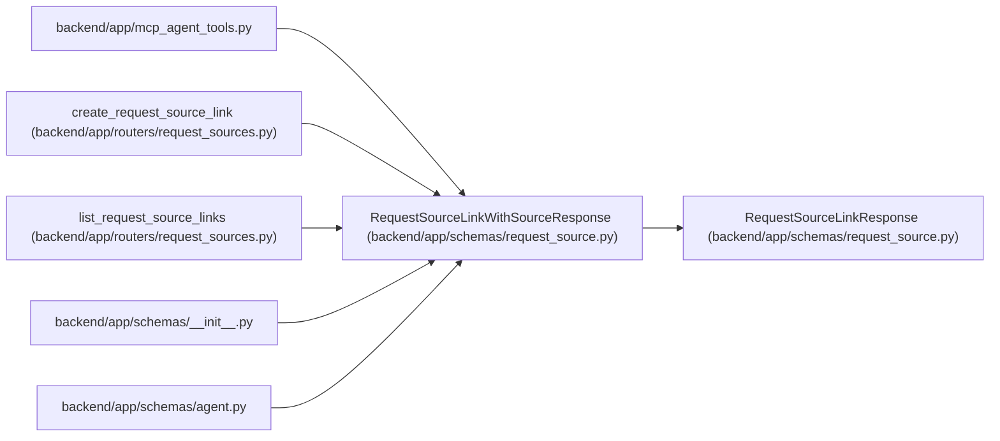

# RequestSourceLinkWithSourceResponse

**Location:** `backend/app/schemas/request_source.py:148`
**Kind:** Pydantic model
**Bases:** `RequestSourceLinkResponse`
**Module:** [schemas_request_source](../modules/schemas_request_source.md)

## Description

Request-source link response with embedded source details.

## Attributes

| Name | Type | Wire name | Required | Nullable | Default | Constraints | Examples | Description |
|------|------|-----------|----------|----------|---------|-------------|-------------|----------|
| `request_source` | `RequestSourceResponse` | `request_source` | Yes | No | — | — | — | — |

## Methods

*No public methods. Inherits from base classes.*

## Relationships

<!-- Auto-generated relationship summary. Do not edit by hand. -->

### Summary

| Module | Methods | Attributes |
|---|---:|---|
| [schemas_request_source](../modules/schemas_request_source.md) | 0 | `request_source` |

### Structure

| Kind | Entity | Module |
|---|---|---|
| Base | `RequestSourceLinkResponse` | [schemas_request_source](../modules/schemas_request_source.md) |

### References

| Reference | Kind | Source | Call sites |
|---|---|---|---:|
| `mcp_agent_tools` | import | [mcp_agent_tools](../modules/mcp_agent_tools.md) | — |
| `create_request_source_link` | type_reference | [request_sources](../modules/request_sources.md) | — |
| `list_request_source_links` | type_reference | [request_sources](../modules/request_sources.md) | — |
| `__init__` | import | [schemas___init__](../modules/schemas___init__.md) | — |
| `agent` | import | [schemas_agent](../modules/schemas_agent.md) | — |
