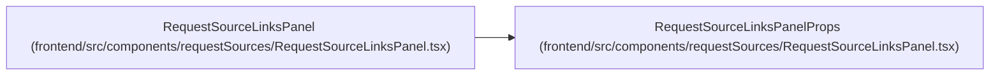

# RequestSourceLinksPanelProps

**Location:** `frontend/src/components/requestSources/RequestSourceLinksPanel.tsx:19`
**Kind:** Class
**Bases:** —
**Module:** [RequestSourceLinksPanel](../modules/RequestSourceLinksPanel.md)

## Description

_Auto-generated from `RequestSourceLinksPanelProps` in `frontend/src/components/requestSources/RequestSourceLinksPanel.tsx`._

## Attributes

| Name | Type | Default | Description |
|------|------|---------|-------------|
| `targetType` | `RequestSourceTargetType` | *required* | — |
| `targetId` | `number` | *required* | — |
| `initialCount` | `number` | *required* | — |
| `title` | `string` | *required* | — |
| `compact` | `boolean` | *required* | — |
| `onChanged` | `() => void` | *required* | — |

## Methods

*No public methods. Inherits from base classes.*

## Relationships

<!-- Auto-generated relationship summary. Do not edit by hand. -->

### Summary

| Module | Methods | Attributes |
|---|---:|---|
| [RequestSourceLinksPanel](../modules/RequestSourceLinksPanel.md) | 0 | `compact`, `initialCount`, `onChanged`, `targetId`, `targetType`, `title` |

### References

| Reference | Kind | Source | Call sites |
|---|---|---|---:|
| `RequestSourceLinksPanel` | type_reference | [RequestSourceLinksPanel](../modules/RequestSourceLinksPanel.md) | — |
