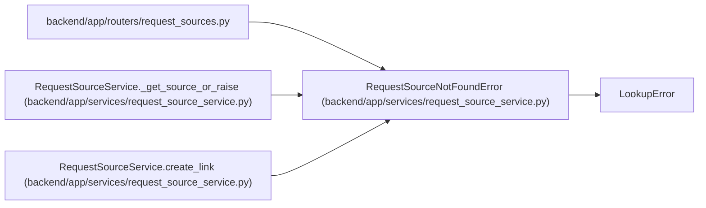

# RequestSourceNotFoundError

**Location:** `backend/app/services/request_source_service.py:27`
**Kind:** Class
**Bases:** `LookupError`
**Module:** [request_source_service](../modules/request_source_service.md)

## Description

Raised when a request source or link cannot be found.

## Attributes

*No annotated attributes found.*

## Methods

*No public methods. Inherits from base classes.*

## Relationships

<!-- Auto-generated relationship summary. Do not edit by hand. -->

### Summary

| Module | Methods | Attributes |
|---|---:|---|
| [request_source_service](../modules/request_source_service.md) | 0 | — |

### Structure

| Kind | Entity | Module |
|---|---|---|
| Base | `LookupError` | — |

### References

| Reference | Kind | Source | Call sites |
|---|---|---|---:|
| `request_sources` | import | [request_sources](../modules/request_sources.md) | — |
| `RequestSourceService._get_source_or_raise` | call | [request_source_service](../modules/request_source_service.md) | 1 |
| `RequestSourceService.create_link` | call | [request_source_service](../modules/request_source_service.md) | 1 |
