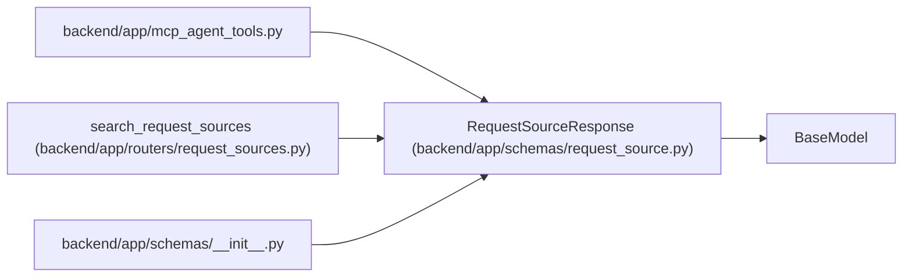

# RequestSourceResponse

**Location:** `backend/app/schemas/request_source.py:77`
**Kind:** Pydantic model
**Bases:** `BaseModel`
**Module:** [schemas_request_source](../modules/schemas_request_source.md)

## Description

Schema for request source responses.

## Model Configuration

| Setting | Value | Source |
|---------|-------|--------|
| `from_attributes` | `True` | model_config |

## Attributes

| Name | Type | Wire name | Required | Nullable | Default | Constraints | Examples | Description |
|------|------|-----------|----------|----------|---------|-------------|-------------|----------|
| `id` | `int` | `id` | Yes | No | — | — | — | — |
| `title` | `str` | `title` | Yes | No | — | — | — | — |
| `description` | `Optional[str]` | `description` | No | Yes | `None` | — | — | — |
| `source_type` | `str` | `source_type` | Yes | No | — | — | — | — |
| `source_name` | `Optional[str]` | `source_name` | No | Yes | `None` | — | — | — |
| `source_url` | `Optional[str]` | `source_url` | No | Yes | `None` | — | — | — |
| `external_key` | `Optional[str]` | `external_key` | No | Yes | `None` | — | — | — |
| `priority_hint` | `Optional[int]` | `priority_hint` | No | Yes | `None` | — | — | — |
| `created_at` | `datetime` | `created_at` | Yes | No | — | — | — | — |

## Methods

*No public methods. Inherits from base classes.*

## Relationships

<!-- Auto-generated relationship summary. Do not edit by hand. -->

### Summary

| Module | Methods | Attributes |
|---|---:|---|
| [schemas_request_source](../modules/schemas_request_source.md) | 0 | `created_at`, `description`, `external_key`, `id`, `priority_hint`, `source_name`, `source_type`, `source_url`, `title` |

### Structure

| Kind | Entity | Module |
|---|---|---|
| Base | `BaseModel` | — |

### References

| Reference | Kind | Source | Call sites |
|---|---|---|---:|
| `mcp_agent_tools` | import | [mcp_agent_tools](../modules/mcp_agent_tools.md) | — |
| `search_request_sources` | type_reference | [request_sources](../modules/request_sources.md) | — |
| `__init__` | import | [schemas___init__](../modules/schemas___init__.md) | — |
