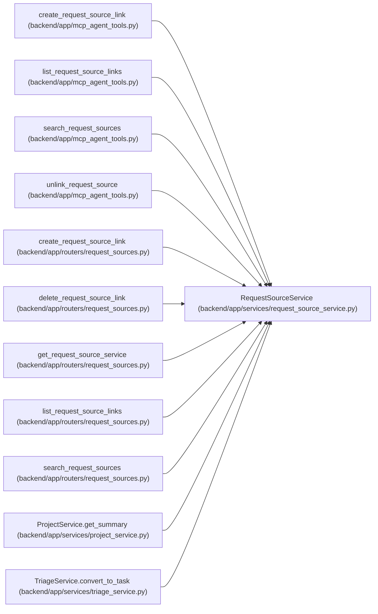

# RequestSourceService

**Location:** `backend/app/services/request_source_service.py:41`
**Kind:** Class
**Bases:** —
**Module:** [request_source_service](../modules/request_source_service.md)

## Description

Small service for direct request-source link counts.

## Attributes

*No annotated attributes found.*

## Methods

| Method | Signature | Decorators | Description |
|--------|-----------|------------|-------------|
| `__init__` | `(db: AsyncSession)` | — | — |
| `_enum_value` | `(value)` | — | Normalize Pydantic enum values before assigning to string columns. |
| `_normalize_target_type` | `(target_type: RequestSourceTargetType \| str) -> RequestSourceTargetType` | — | Convert API target type strings to the request-source target enum. |
| `_target_model_and_field` | `(target_type: RequestSourceTargetType \| str)` | — | Return the ORM model and link column for a target type. |
| `_require_target_exists` | *(async)* `(target_type: RequestSourceTargetType \| str, target_id: int) -> None` | — | Validate that a requested link target exists. |
| `_get_source_or_raise` | *(async)* `(request_source_id: int) -> RequestSource` | — | Load an existing request source or raise a 404-mapped error. |
| `_source_from_payload` | `(data: RequestSourceCreate) -> RequestSource` | — | Build a request source model from API data. |
| `_source_type_from_triage` | `(item: TriageItem) -> str` | — | Choose a request-source type for a triage-originated request. |
| `_source_from_triage_item` | `(item: TriageItem) -> RequestSource` | — | Build a request source from a triage item. |
| `search_sources` | *(async)* `(q: Optional[str] = None, source_type: Optional[str] = None, limit: int = 20) -> Sequence[RequestSource]` | — | Search existing request sources for linking. |
| `get_link` | *(async)* `(link_id: int) -> Optional[RequestSourceLink]` | — | Load a request-source link with embedded source data. |
| `list_links_for_target` | *(async)* `(target_type: RequestSourceTargetType \| str, target_id: int) -> Sequence[RequestSourceLink]` | — | List request-source links for a target. |
| `create_link` | *(async)* `(data: RequestSourceLinkCreateRequest, *, commit: bool = True) -> RequestSourceLink` | — | Create a link from an existing or new request source. |
| `unlink` | *(async)* `(link_id: int, *, commit: bool = True) -> bool` | — | Remove a request-source link without deleting the source. |
| `link_triage_item_as_task_request` | *(async)* `(item: TriageItem, task_id: int) -> RequestSourceLink` | — | Create a new request source from triage intake and link it to a task. |
| `copy_triage_links_to_task` | *(async)* `(triage_item_id: int, task_id: int) -> int` | — | Copy request-source links from a triage item to a newly converted task. |
| `count_for_task` | *(async)* `(task_id: int) -> int` | — | Count request sources directly linked to a task. |
| `count_for_project` | *(async)* `(project_id: int) -> int` | — | Count request sources directly linked to a project. |
| `count_for_triage_item` | *(async)* `(triage_item_id: int) -> int` | — | Count request sources directly linked to a triage item. |

## Relationships

<!-- Auto-generated relationship summary. Do not edit by hand. -->

### Summary

| Module | Methods | Attributes |
|---|---:|---|
| [request_source_service](../modules/request_source_service.md) | 19 | — |

### References

| Reference | Kind | Source | Call sites |
|---|---|---|---:|
| `create_request_source_link` | call | [mcp_agent_tools](../modules/mcp_agent_tools.md) | 1 |
| `list_request_source_links` | call | [mcp_agent_tools](../modules/mcp_agent_tools.md) | 1 |
| `search_request_sources` | call | [mcp_agent_tools](../modules/mcp_agent_tools.md) | 1 |
| `unlink_request_source` | call | [mcp_agent_tools](../modules/mcp_agent_tools.md) | 1 |
| `create_request_source_link` | type_reference | [request_sources](../modules/request_sources.md) | — |
| `delete_request_source_link` | type_reference | [request_sources](../modules/request_sources.md) | — |
| `get_request_source_service` | call | [request_sources](../modules/request_sources.md) | 1 |
| `get_request_source_service` | type_reference | [request_sources](../modules/request_sources.md) | — |
| `list_request_source_links` | type_reference | [request_sources](../modules/request_sources.md) | — |
| `search_request_sources` | type_reference | [request_sources](../modules/request_sources.md) | — |
| `ProjectService.get_summary` | call | [project_service](../modules/project_service.md) | 1 |
| `TriageService.convert_to_task` | call | [triage_service](../modules/triage_service.md) | 1 |

> References: showing 12 of 13 logical references; 1 omitted by the 12-row generated summary limit.
