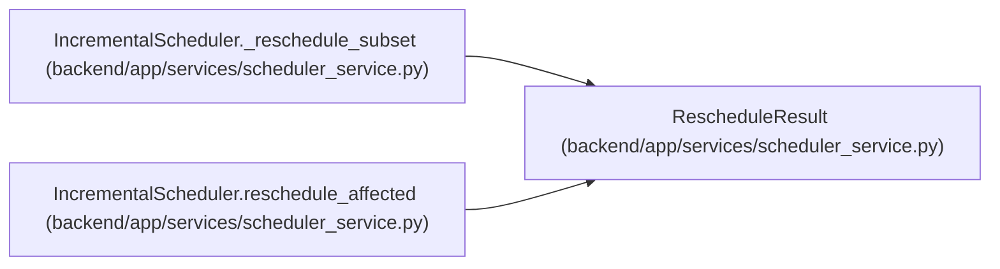

# RescheduleResult

**Location:** `backend/app/services/scheduler_service.py:51`
**Kind:** Class
**Bases:** —
**Module:** [scheduler_service](../modules/scheduler_service.md)

**Decorators:** `@dataclass`

## Description

Result of an incremental reschedule operation.

## Attributes

| Name | Type | Default | Description |
|------|------|---------|-------------|
| `affected_task_ids` | `list[int]` | *required* | — |
| `rescheduled_count` | `int` | *required* | — |
| `decisions` | `list[SchedulingDecision]` | *required* | — |

## Methods

*No public methods. Inherits from base classes.*

## Relationships

<!-- Auto-generated relationship summary. Do not edit by hand. -->

### Summary

| Module | Methods | Attributes |
|---|---:|---|
| [scheduler_service](../modules/scheduler_service.md) | 0 | `affected_task_ids`, `decisions`, `rescheduled_count` |

### References

| Reference | Kind | Source | Call sites |
|---|---|---|---:|
| `IncrementalScheduler._reschedule_subset` | call | [scheduler_service](../modules/scheduler_service.md) | 3 |
| `IncrementalScheduler._reschedule_subset` | type_reference | [scheduler_service](../modules/scheduler_service.md) | — |
| `IncrementalScheduler.reschedule_affected` | call | [scheduler_service](../modules/scheduler_service.md) | 1 |
| `IncrementalScheduler.reschedule_affected` | type_reference | [scheduler_service](../modules/scheduler_service.md) | — |
