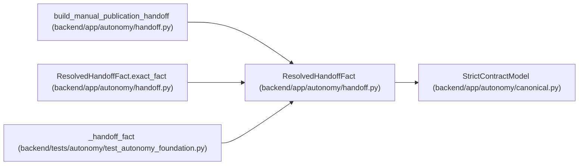

# ResolvedHandoffFact

**Location:** `backend/app/autonomy/handoff.py:48`
**Kind:** Pydantic model
**Bases:** `StrictContractModel`
**Module:** [handoff](../modules/handoff.md)

## Description

A resolver-produced source fact; prose/booleans cannot substitute.

## Validators

| Method | Scope | Fields | Mode | Options |
|--------|-------|--------|------|---------|
| `exact_fact` | model | — | after | — |

## Attributes

| Name | Type | Wire name | Required | Nullable | Default | Constraints | Examples | Description |
|------|------|-----------|----------|----------|---------|-------------|-------------|----------|
| `fact_kind` | `str` | `fact_kind` | Yes | No | — | pattern=unknown (IDENTIFIER_PATTERN) | — | — |
| `object_digest` | `str` | `object_digest` | Yes | No | — | pattern=unknown (SHA256_PATTERN) | — | — |
| `object_uri` | `str` | `object_uri` | Yes | No | — | max_length=2048; min_length=1 | — | — |
| `evidence` | `SignedAutonomousEvidence` | `evidence` | Yes | No | — | — | — | — |

## Methods

| Method | Signature | Decorators | Description |
|--------|-----------|------------|-------------|
| `exact_fact` | `() -> 'ResolvedHandoffFact'` | `@model_validator(mode='after')` | — |

## Relationships

<!-- Auto-generated relationship summary. Do not edit by hand. -->

### Summary

| Module | Methods | Attributes |
|---|---:|---|
| [handoff](../modules/handoff.md) | 1 | `evidence`, `fact_kind`, `object_digest`, `object_uri` |

### Structure

| Kind | Entity | Module |
|---|---|---|
| Base | `StrictContractModel` | [autonomy_canonical](../modules/autonomy_canonical.md) |

### References

| Reference | Kind | Source | Call sites |
|---|---|---|---:|
| `build_manual_publication_handoff` | type_reference | [handoff](../modules/handoff.md) | — |
| `ResolvedHandoffFact.exact_fact` | type_reference | [handoff](../modules/handoff.md) | — |
| `_handoff_fact` | call | [test_autonomy_foundation](../modules/test_autonomy_foundation.md) | 1 |
| `_handoff_fact` | type_reference | [test_autonomy_foundation](../modules/test_autonomy_foundation.md) | — |
