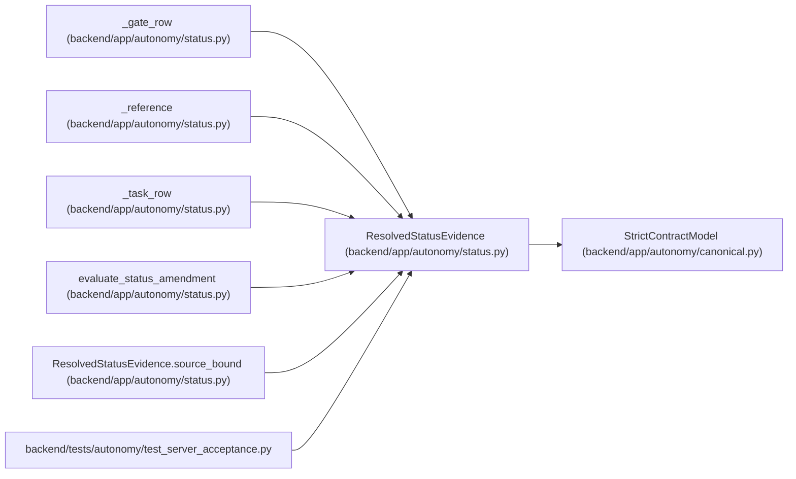

# ResolvedStatusEvidence

**Location:** `backend/app/autonomy/status.py:45`
**Kind:** Pydantic model
**Bases:** `StrictContractModel`
**Module:** [status](../modules/status.md)

## Description

A resolver-produced reference to one signed immutable source envelope.

## Validators

| Method | Scope | Fields | Mode | Options |
|--------|-------|--------|------|---------|
| `source_bound` | model | — | after | — |

## Attributes

| Name | Type | Wire name | Required | Nullable | Default | Constraints | Examples | Description |
|------|------|-----------|----------|----------|---------|-------------|-------------|----------|
| `evidence_kind` | `str` | `evidence_kind` | Yes | No | — | pattern=unknown (IDENTIFIER_PATTERN) | — | — |
| `object_digest` | `str` | `object_digest` | Yes | No | — | pattern=unknown (SHA256_PATTERN) | — | — |
| `object_uri` | `str` | `object_uri` | Yes | No | — | min_length=1; max_length=2048 | — | — |
| `signed_evidence` | `SignedAutonomousEvidence` | `signed_evidence` | Yes | No | — | — | — | — |
| `expires_at` | `datetime \| None` | `expires_at` | No | Yes | `None` | — | — | — |
| `reset_trigger` | `str` | `reset_trigger` | Yes | No | — | min_length=1; max_length=512 | — | — |

## Methods

| Method | Signature | Decorators | Description |
|--------|-----------|------------|-------------|
| `source_bound` | `() -> 'ResolvedStatusEvidence'` | `@model_validator(mode='after')` | — |

## Relationships

<!-- Auto-generated relationship summary. Do not edit by hand. -->

### Summary

| Module | Methods | Attributes |
|---|---:|---|
| [status](../modules/status.md) | 1 | `evidence_kind`, `expires_at`, `object_digest`, `object_uri`, `reset_trigger`, `signed_evidence` |

### Structure

| Kind | Entity | Module |
|---|---|---|
| Base | `StrictContractModel` | [autonomy_canonical](../modules/autonomy_canonical.md) |

### References

| Reference | Kind | Source | Call sites |
|---|---|---|---:|
| `_gate_row` | type_reference | [status](../modules/status.md) | — |
| `_reference` | type_reference | [status](../modules/status.md) | — |
| `_task_row` | type_reference | [status](../modules/status.md) | — |
| `evaluate_status_amendment` | type_reference | [status](../modules/status.md) | — |
| `ResolvedStatusEvidence.source_bound` | type_reference | [status](../modules/status.md) | — |
| `test_server_acceptance` | import | [test_server_acceptance](../modules/test_server_acceptance.md) | — |
